# Attendify - Attendance Management System

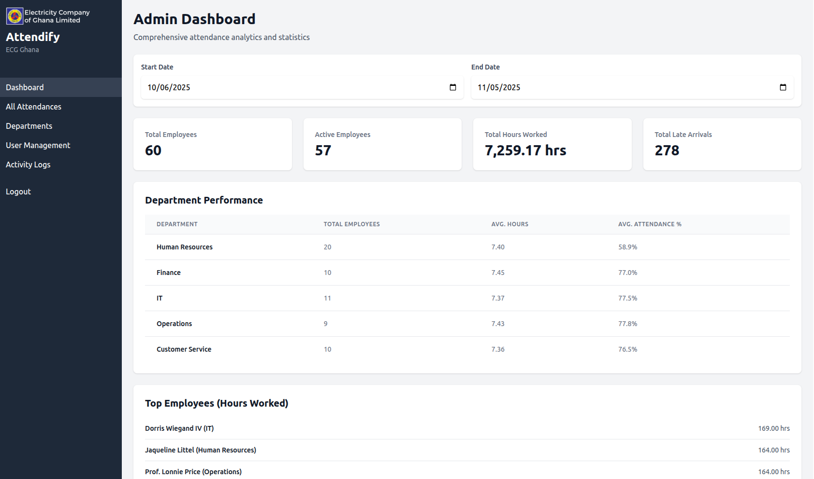

An attendance management system for ECG Ghana built with Laravel 12, Livewire 3, and Tailwind CSS, containerized with Docker and Docker Compose.

## Table of Contents

-   [User Interface Guide](#user-interface-guide)
    -   [Authentication](#authentication)
        -   [User Login](#user-login)
        -   [Admin Login](#admin-login)
        -   [Department Head Login](#department-head-login)
    -   [Regular User Interface](#regular-user-interface)
        -   [User Dashboard](#user-dashboard)
        -   [Clock In](#clock-in)
        -   [Clock Out](#clock-out)
        -   [My Attendance Records](#my-attendance-records)
    -   [Admin Interface](#admin-interface)
        -   [Admin Dashboard](#admin-dashboard)
        -   [All Attendances Portal](#all-attendances-portal)
        -   [User Management](#user-management-admin)
        -   [Departments Management](#departments-management)
        -   [Activity Logs](#activity-logs-admin)
    -   [Department Head Interface](#department-head-interface)
        -   [Employee Management](#employee-management)
        -   [Employee CRUD Operations](#employee-crud-operations)
-   [Features](#features)
    -   [User Features](#user-features)
    -   [Admin Features](#admin-features)
    -   [Department Head Features](#department-head-features)
-   [Technology Stack](#technology-stack)
-   [Prerequisites](#prerequisites)
-   [Installation](#installation)
-   [Accessing the Application](#accessing-the-application)
-   [Default Credentials](#default-credentials)
-   [Database Seeding](#database-seeding)
    -   [Initial Seeders](#initial-seeders)
    -   [Fake Data Seeder](#fake-data-seeder)
-   [Docker Services](#docker-services)
-   [Project Structure](#project-structure)
-   [Roles and Permissions](#roles-and-permissions)
    -   [User](#user)
    -   [Admin](#admin)
    -   [Department Head](#department-head)
-   [Key Features](#key-features)
    -   [Attendance Tracking](#attendance-tracking)
    -   [Activity Logging](#activity-logging)
    -   [Analytics](#analytics)
-   [Metrics and Calculations](#metrics-and-calculations)
    -   [Late Arrival Detection](#late-arrival-detection)
    -   [Total Hours Worked](#total-hours-worked)
    -   [Early Departure Detection](#early-departure-detection)
    -   [Attendance Percentage](#attendance-percentage)
    -   [Overtime Hours](#overtime-hours)
    -   [Average Break Time](#average-break-time)
    -   [Department Statistics (Admin Dashboard)](#department-statistics-admin-dashboard)
    -   [Employee Rankings](#employee-rankings)
    -   [Working Days Calculation](#working-days-calculation)
    -   [Standard Work Hours](#standard-work-hours)
-   [Configuration](#configuration)
-   [Development](#development)
    -   [Running Commands](#running-commands)
    -   [Frontend Development](#frontend-development)
    -   [Database Access](#database-access)
-   [Troubleshooting](#troubleshooting)
    -   [Permission Issues](#permission-issues)
    -   [Clear Cache](#clear-cache)
-   [License](#license)
-   [Support](#support)

## User Interface Guide

This section provides detailed documentation of the user interface for each role, based on screenshots from the `user-actions` folder. Each screenshot demonstrates specific capabilities and features available to different user roles.

### Authentication

All users (Admin, Department Head, and Regular Users) access the application through a unified login page. The authentication system uses Laravel Sanctum for secure session management.

#### User Login


**Description**: The login page for regular employees. Features include:

-   **ECG Ghana Logo**: Official branding displayed prominently
-   **Email/Password Authentication**: Secure login credentials
-   **Remember Me**: Optional checkbox to maintain session
-   **Responsive Design**: Modern gradient background with card-based form
-   **Access**: After login, users are redirected to their personal dashboard

**Capabilities After Login**:

-   Clock in/out for daily attendance
-   View personal attendance analytics dashboard
-   View and filter personal attendance records
-   Track personal metrics (hours worked, late arrivals, etc.)

#### Admin Login

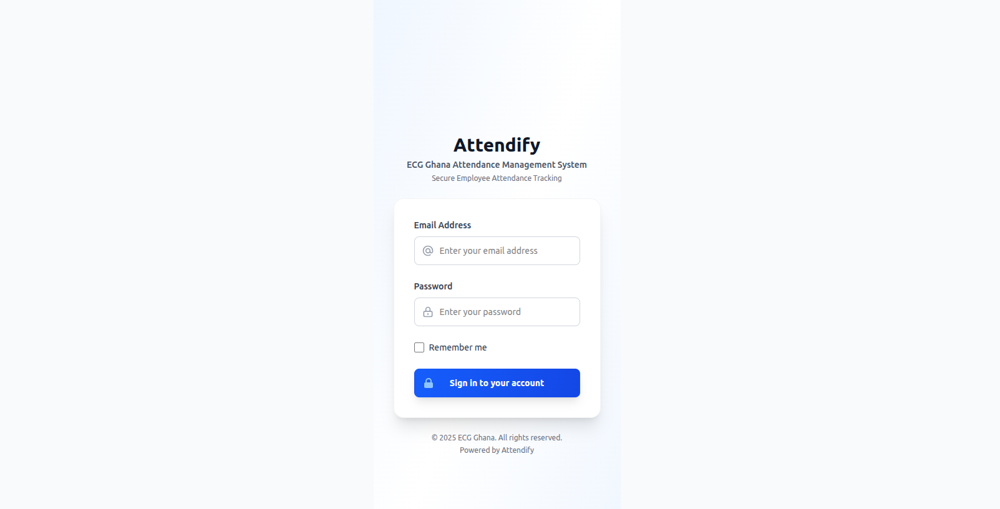

**Description**: The same login interface used by administrators. The login page is role-agnostic - all users see the same authentication screen. After successful authentication, users are automatically redirected based on their role:

-   **Admin** → Admin Dashboard (`/admin/dashboard`)
-   **Department Head** → Employee Management (`/dept-head/employees`)
-   **Regular User** → User Dashboard (`/dashboard`)

**Capabilities After Login**:

-   Full system administration access
-   View and edit all attendance records
-   Manage users, departments, and roles
-   View comprehensive analytics and reports
-   Access activity logs for audit trails

#### Department Head Login


**Description**: Same login interface as other roles. Department Heads are automatically redirected to the Employee Management page after login.

**Capabilities After Login**:

-   Manage employees within their assigned department
-   Add new employees to their department
-   View employee list and details

### Regular User Interface

Regular users have access to personal attendance tracking and viewing capabilities. They cannot modify attendance records or access other users' data.

#### User Dashboard

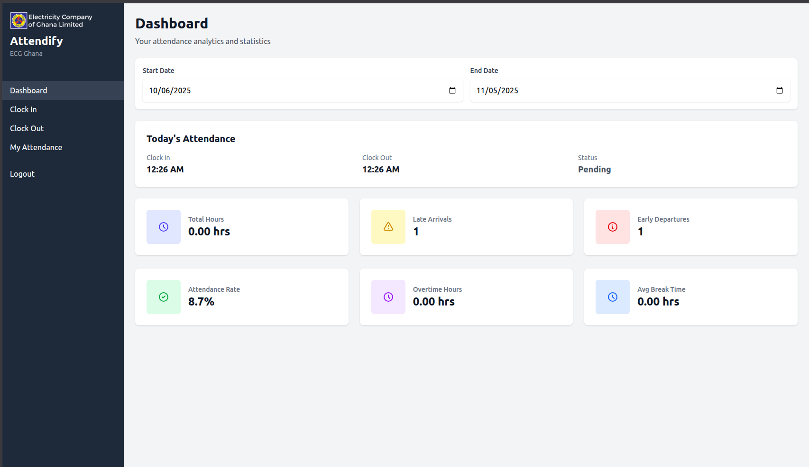

**Description**: Personal analytics dashboard for regular employees showing their attendance statistics.

**Features**:

-   **Date Range Filter**: Select custom date ranges (default: last 30 days) to analyze attendance patterns
-   **Today's Attendance Status**: Quick view of current day's clock-in/out status
-   **Key Metrics Display**:
    -   **Total Hours Worked**: Sum of all hours across the selected date range
    -   **Late Arrivals Count**: Number of times the employee clocked in after 8:30 AM
    -   **Early Departures Count**: Number of times the employee left before 5:00 PM with less than 8 hours worked
    -   **Attendance Percentage**: Percentage of working days attended
    -   **Overtime Hours**: Total hours worked beyond the standard 8-hour workday
    -   **Average Break Time**: Calculated break duration based on work patterns

**What Users Can Do**:

-   View their personal attendance analytics
-   Adjust date ranges to analyze different time periods
-   Monitor their attendance patterns and performance
-   Track their own compliance with work hours and schedules

#### Clock In

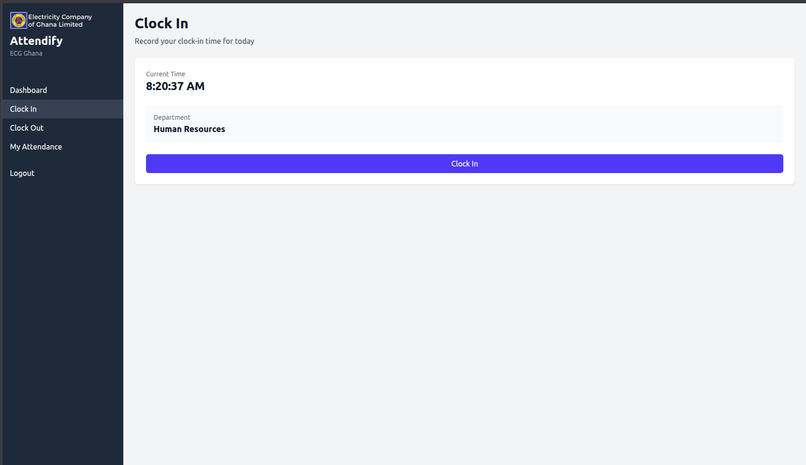

**Description**: Simple one-click clock-in interface for employees to mark their arrival.

**Features**:

-   **One-Click Clock-In**: Single button to record arrival time
-   **Automatic Late Detection**: System automatically flags late arrivals (after 8:30 AM)
-   **Once Per Day**: Prevents multiple clock-ins on the same day
-   **Status Display**: Shows current day's attendance status
-   **Time Recording**: Captures exact timestamp of clock-in

**What Users Can Do**:

-   Clock in once per day
-   View their current attendance status
-   See if they're marked as late (if clocking in after 8:30 AM)
-   Receive confirmation of successful clock-in

**System Behavior**:

-   Creates a new attendance record for the day
-   Sets `clock_in_time` to current timestamp
-   Marks attendance as `'late'` if clock-in is after 8:30 AM, otherwise `'present'`
-   Logs the activity in the activity log system

#### Clock Out

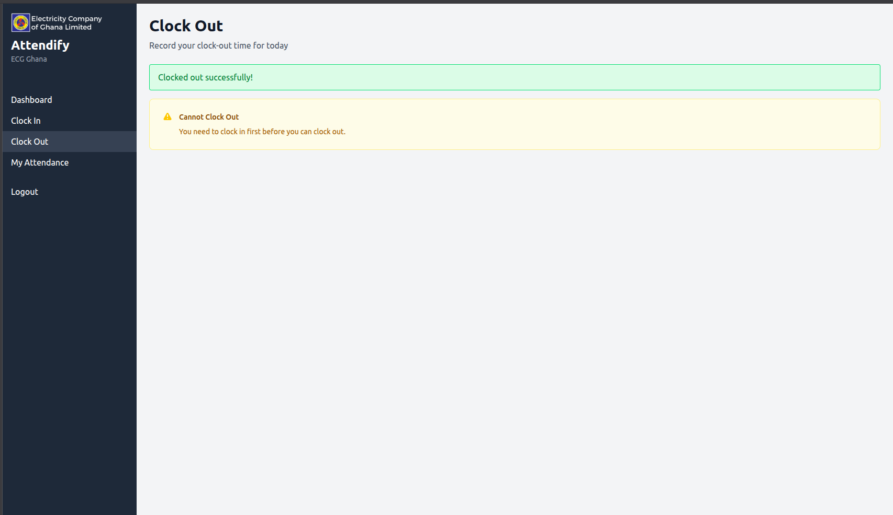

**Description**: Interface for employees to clock out at the end of their workday.

**Features**:

-   **One-Click Clock-Out**: Single button to record departure time
-   **Automatic Early Departure Detection**: Flags early departures (before 5:00 PM with < 8 hours)
-   **Total Hours Calculation**: Automatically calculates hours worked for the day
-   **Status Validation**: Ensures user has clocked in before allowing clock-out
-   **Time Recording**: Captures exact timestamp of clock-out

**What Users Can Do**:

-   Clock out once per day (after clocking in)
-   View calculated total hours worked
-   See if they're marked as early departure
-   Receive confirmation of successful clock-out

**System Behavior**:

-   Updates the day's attendance record with `clock_out_time`
-   Calculates and stores `total_hours` worked
-   Marks `is_early_departure` if conditions are met (before 5 PM AND < 8 hours)
-   Logs the activity in the activity log system

#### My Attendance Records

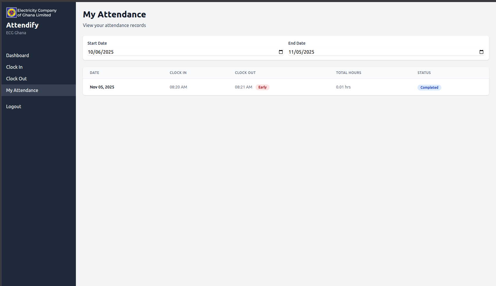

**Description**: Personal attendance history view with filtering capabilities.

**Features**:

-   **Date Range Filter**: Select start and end dates to view specific periods
-   **Comprehensive Table**: Displays all attendance records with:
    -   Date of attendance
    -   Clock-in time
    -   Clock-out time
    -   Total hours worked
    -   Late arrival indicator
    -   Early departure indicator
    -   Attendance status (present/late/absent)
-   **Sorted Display**: Records sorted by date (newest first)
-   **Status Indicators**: Visual indicators for late arrivals and early departures

**What Users Can Do**:

-   View their complete attendance history
-   Filter records by date range (default: last 30 days)
-   Review their attendance patterns over time
-   Identify days with late arrivals or early departures
-   Track their total hours worked per day

**Note**: Users can only view their own attendance records. They cannot modify or delete records.

### Admin Interface

Administrators have full system access, including user management, department management, attendance editing, and comprehensive analytics.

#### Admin Dashboard


**Description**: Comprehensive analytics dashboard providing organization-wide insights.

**Features**:

-   **Date Range Filter**: Customizable date range for analytics (default: last 30 days)
-   **Organization Metrics**:
    -   **Total Employees**: Count of all users in the system
    -   **Active Employees**: Count of employees with attendance records in the selected period
-   **Department Statistics**: Performance metrics for each department:
    -   Average hours worked per department
    -   Average late arrival percentage
    -   Average early departure percentage
    -   Average attendance percentage
-   **Employee Rankings**: Top 10 employees by total hours worked in the selected period
-   **Export Capabilities**: Ability to export reports and analytics data

**What Admins Can Do**:

-   View organization-wide attendance analytics
-   Compare department performance
-   Identify top-performing employees
-   Analyze attendance trends across the organization
-   Export reports for further analysis
-   Adjust date ranges to analyze different time periods

#### All Attendances Portal

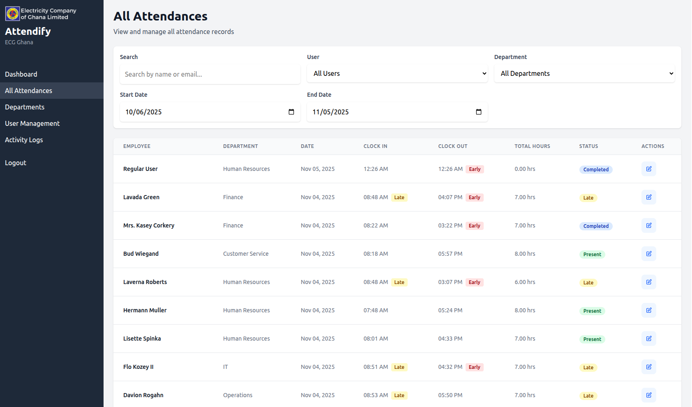

**Description**: Centralized view of all employee attendance records across the organization.

**Features**:

-   **Advanced Filtering**:
    -   Search by employee name or email
    -   Filter by specific employee
    -   Filter by department
    -   Filter by date range
-   **Comprehensive Table**: Displays:
    -   Employee name and email
    -   Department
    -   Attendance date
    -   Clock-in time
    -   Clock-out time
    -   Total hours worked
    -   Late arrival status
    -   Early departure status
    -   Attendance status
-   **Pagination**: Handles large datasets efficiently (20 records per page)
-   **Edit Access**: Direct links to edit any attendance record

**What Admins Can Do**:

-   View all attendance records across all departments
-   Search and filter attendance data by multiple criteria
-   Access edit functionality for any attendance record
-   Monitor organization-wide attendance patterns
-   Identify attendance issues or anomalies
-   Export filtered attendance data

#### User Management

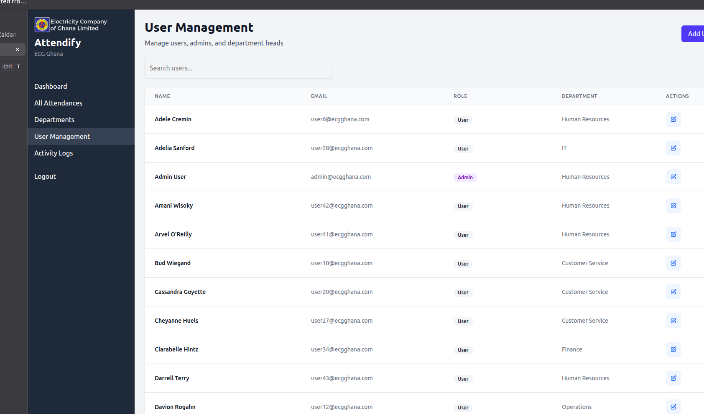

**Description**: Full CRUD interface for managing all users in the system.

**Features**:

-   **User List**: Table displaying all users with:
    -   Name and email
    -   Assigned role (Admin, Department Head, User)
    -   Department assignment
    -   Actions (Edit/Delete)
-   **Create User Modal**: Form to create new users with:
    -   Name, email, password fields
    -   Role selection (Admin, Department Head, User)
    -   Department assignment
-   **Edit User Modal**: Modify existing user details:
    -   Update name, email
    -   Change role assignment
    -   Reassign department
    -   Update password (optional)
-   **Search Functionality**: Search users by name or email
-   **Role Management**: Assign and change user roles dynamically

**What Admins Can Do**:

-   **Create Users**: Add new Admin, Department Head, or Regular User accounts
-   **Edit Users**: Modify user details, roles, and department assignments
-   **Delete Users**: Remove users from the system (with proper cascading)
-   **Manage Roles**: Assign or change roles for any user
-   **Department Assignment**: Assign users to departments
-   **Search Users**: Quickly find specific users in the system

**Security**: Only users with the Admin role can access this interface. All user management actions are logged in the activity log system.

#### Departments Management

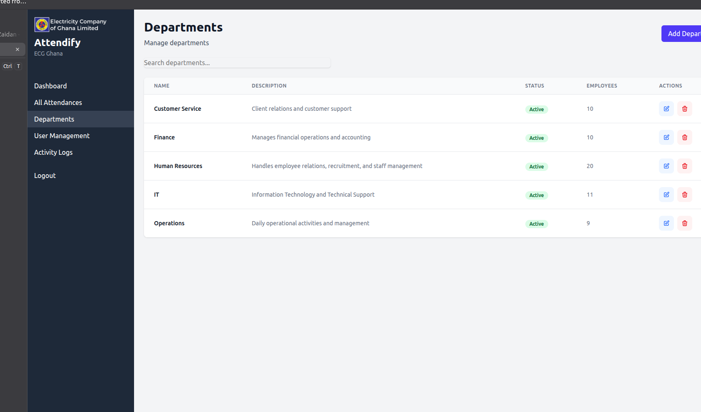

**Description**: Complete CRUD interface for managing organizational departments.

**Features**:

-   **Department List**: Table showing all departments with:
    -   Department name
    -   Description
    -   Status (Active/Inactive)
    -   Number of employees
    -   Actions (Edit/Delete)
-   **Create Department Modal**: Form to create new departments:
    -   Name field
    -   Description field
    -   Status selection (Active/Inactive)
-   **Edit Department Modal**: Modify existing department details:
    -   Update name and description
    -   Change status (activate/deactivate)
-   **Status Management**: Toggle departments between active and inactive states
-   **Employee Count**: Display number of employees in each department

**What Admins Can Do**:

-   **Create Departments**: Add new organizational departments
-   **Edit Departments**: Modify department names, descriptions, and status
-   **Delete Departments**: Remove departments (with proper validation)
-   **Activate/Deactivate**: Toggle department status to control access
-   **View Employee Count**: See how many employees are assigned to each department

**Business Logic**:

-   Inactive departments cannot have new employees assigned
-   Existing employees in inactive departments remain assigned
-   Department deletion requires validation to prevent data loss

#### Activity Logs

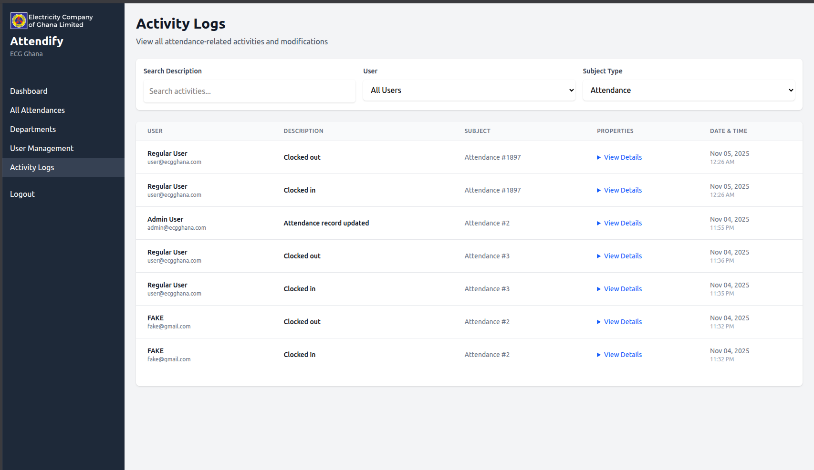

**Description**: Comprehensive audit trail of all system activities and modifications.

**Features**:

-   **Advanced Filtering**:
    -   Search by activity description
    -   Filter by user who performed the action
    -   Filter by subject type (Attendance, User, Department, etc.)
-   **Detailed Log Table**: Displays:
    -   User who performed the action (name and email)
    -   Activity description (e.g., "User clocked in", "Attendance updated")
    -   Subject (related model and ID)
    -   Properties (detailed change information)
    -   Date and time of activity
-   **Expandable Details**: Click to view detailed change information:
    -   **Old Data**: Previous values before modification
    -   **New Data**: Updated values after modification
    -   **Updated By**: Admin who made the change (for admin edits)
-   **Chronological Order**: Logs sorted by newest first
-   **Pagination**: Handles large log datasets (20 records per page)

**What Admins Can Do**:

-   **View All Activities**: See every action performed in the system
-   **Audit Attendance Changes**: Track who modified attendance records and when
-   **Monitor User Actions**: View all clock-in/out activities
-   **Track System Modifications**: See changes to users, departments, and other entities
-   **Investigate Issues**: Use logs to troubleshoot problems or investigate discrepancies
-   **Filter Logs**: Narrow down logs by user, type, or description

**Logged Activities Include**:

-   All clock-in/out events
-   Attendance record modifications by admins
-   User creation and updates
-   Department creation and updates
-   Role assignments
-   Any other system changes

### Department Head Interface

Department Heads have limited administrative access focused on managing employees within their assigned department.

#### Employee Management

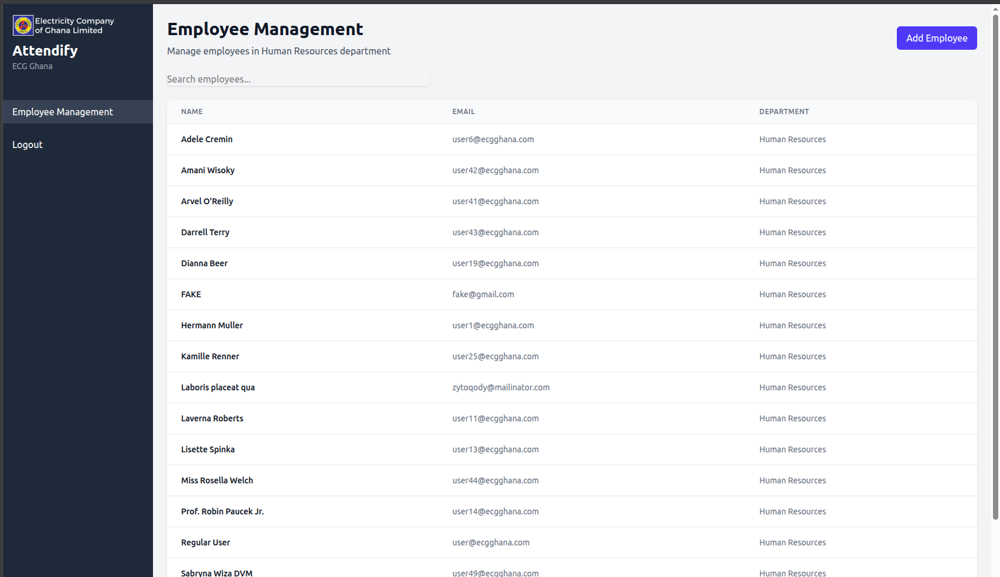

**Description**: Main interface for Department Heads to view and manage employees in their department.

**Features**:

-   **Employee List**: Table displaying all employees in the department head's assigned department:
    -   Employee name and email
    -   Role (typically Regular Users)
    -   Date added to department
    -   Actions (if applicable)
-   **Add Employee Button**: Quick access to add new employees
-   **Department Context**: Automatically filtered to show only employees from the department head's department
-   **Search Functionality**: Search employees by name or email

**What Department Heads Can Do**:

-   View all employees assigned to their department
-   See employee details and contact information
-   Access employee management functions
-   Search for specific employees

**Limitations**:

-   Can only view employees from their own department
-   Cannot view employees from other departments
-   Cannot modify user roles or system-wide settings
-   Cannot access admin functions

#### Employee CRUD Operations

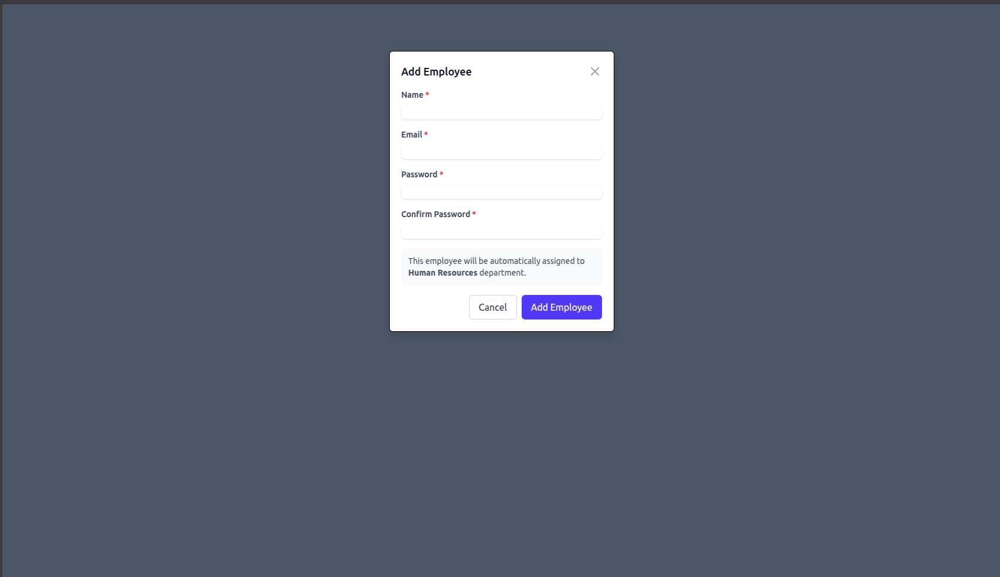

**Description**: Interface for Department Heads to add and manage employees in their department.

**Features**:

-   **Create Employee Modal**: Form to add new employees:
    -   Name field
    -   Email field
    -   Password field
    -   Role assignment (automatically set to "User" role)
    -   Department assignment (automatically set to department head's department)
-   **Employee List**: View all employees in the department
-   **Validation**: Ensures email uniqueness and proper data entry

**What Department Heads Can Do**:

-   **Add Employees**: Create new user accounts for their department
-   **Assign to Department**: New employees are automatically assigned to the department head's department
-   **Set Initial Credentials**: Provide name, email, and password for new employees
-   **View Department Employees**: See all current employees in their department

**Business Rules**:

-   New employees are automatically assigned the "User" role (cannot create admins or other department heads)
-   Employees are automatically assigned to the department head's department
-   Department Heads cannot remove employees from their department (requires admin action)
-   Department Heads cannot modify employee details after creation (requires admin action)

**Note**: Department Heads can only add employees to their own department. They cannot transfer employees between departments or modify employee roles.

## Features

### User Features

-   **Authentication**: Secure login system using Laravel Sanctum
-   **Clock In/Out**: Simple one-click clock-in and clock-out (once per day)
-   **My Attendance**: View personal attendance records with date range filtering
-   **Dashboard**: Comprehensive analytics dashboard showing:
    -   Total hours worked
    -   Late arrivals count
    -   Early departures count
    -   Attendance percentage
    -   Overtime hours tracking
    -   Average break time

### Admin Features

-   **All Attendances**: View and manage all employee attendance records
-   **Edit Attendance**: Modify any attendance record (clock-in/out times)
-   **User Management**: Full CRUD operations for creating and managing:
    -   Admin users
    -   Department Head users
    -   Regular users
-   **Department Management**: Full CRUD operations for departments with status (active/inactive)
-   **Analytics Dashboard**: Comprehensive dashboard with:
    -   Total and active employee counts
    -   Department performance statistics
    -   Employee rankings by hours worked
    -   Exportable reports

### Department Head Features

-   **Employee Management**: Add and manage employees within their assigned department
-   **Personal Dashboard**: View their own attendance analytics

## Technology Stack

-   **Backend**: Laravel 12
-   **Frontend**: Livewire 3, Tailwind CSS, Alpine.js
-   **Database**: MySQL 8.0
-   **Authentication**: Laravel Sanctum
-   **Authorization**: Spatie Laravel Permission (Role-Based Access Control)
-   **Containerization**: Docker & Docker Compose
-   **Build Tool**: Vite

## Architectural Overview

The Attendify system follows a layered architecture pattern with clear separation of concerns. The system is designed to be scalable, maintainable, and secure, with comprehensive documentation through various architectural diagrams. This section provides an overview of the system's architecture, data flow, and design patterns.

### System Architecture

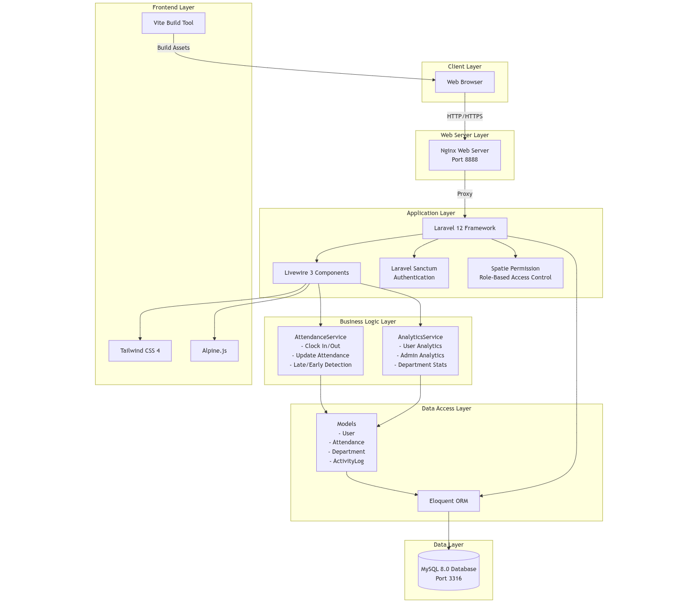

The system architecture is organized into distinct layers, each with specific responsibilities:

-   **Client Layer**: Web browsers render the user interface using responsive Tailwind CSS components
-   **Web Server Layer**: Nginx acts as a reverse proxy, handling HTTP requests and routing to PHP-FPM
-   **Application Layer**: Laravel 12 framework manages routing, middleware, and MVC architecture, with Livewire 3 providing dynamic UI components
-   **Business Logic Layer**: Service classes (`AttendanceService`, `AnalyticsService`) encapsulate core business rules and calculations
-   **Data Access Layer**: Eloquent ORM provides database abstraction through model classes
-   **Data Layer**: MySQL 8.0 stores all application data with transaction support for data integrity

For detailed component interactions and layer descriptions, see the [System Architecture Diagram documentation](diagrams/04-system-architecture-diagram.md).

### Component Architecture

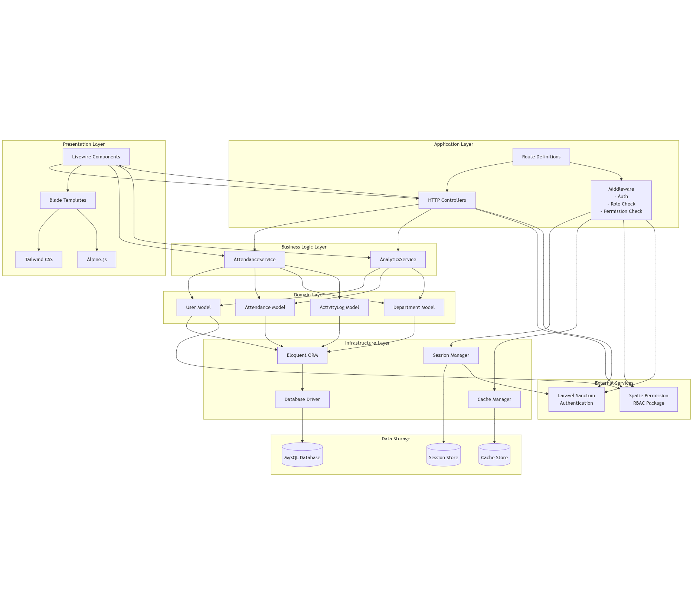

The component diagram illustrates the system's modular design and dependencies:

-   **Presentation Layer**: Livewire components and Blade templates with Tailwind CSS and Alpine.js for frontend interactivity
-   **Application Layer**: HTTP controllers, middleware for authentication and authorization, and route definitions
-   **Business Logic Layer**: Service classes that handle attendance operations and analytics calculations
-   **Domain Layer**: Eloquent models representing core business entities (User, Attendance, Department, ActivityLog)
-   **Infrastructure Layer**: Database drivers, session management, and caching mechanisms
-   **External Services**: Spatie Permission for RBAC and Laravel Sanctum for authentication

This layered approach ensures separation of concerns, making the system easier to maintain and test. See the [Component Diagram documentation](diagrams/09-component-diagram.md) for detailed component descriptions and interactions.

### Database Schema

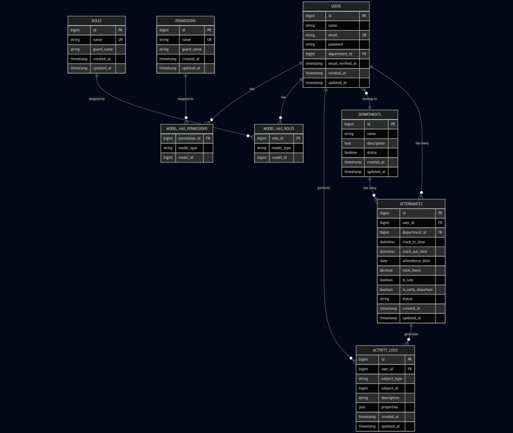

The database schema follows a relational model with the following key entities:

-   **Users**: Store employee information, credentials, and department assignments
-   **Departments**: Organizational units with status management (active/inactive)
-   **Attendances**: Daily attendance records with clock-in/out times, calculated metrics, and status flags
-   **Activity Logs**: Comprehensive audit trail using polymorphic relationships to track all system activities
-   **Roles & Permissions**: Many-to-many relationships managed by Spatie Permission package

**Key Relationships**:

-   Users belong to one Department (Many-to-One)
-   Users have many Attendance records (One-to-Many)
-   Users generate many Activity Logs (One-to-Many)
-   Users can have multiple Roles via Spatie Permission (Many-to-Many)

**Constraints**:

-   Unique constraint on `(user_id, attendance_date)` ensures one attendance record per user per day
-   Foreign key constraints with CASCADE on delete maintain referential integrity
-   Email uniqueness ensures no duplicate user accounts

For complete schema details, see the [Entity Relationship Diagram documentation](diagrams/01-entity-relationship-diagram.md).

### Data Flow

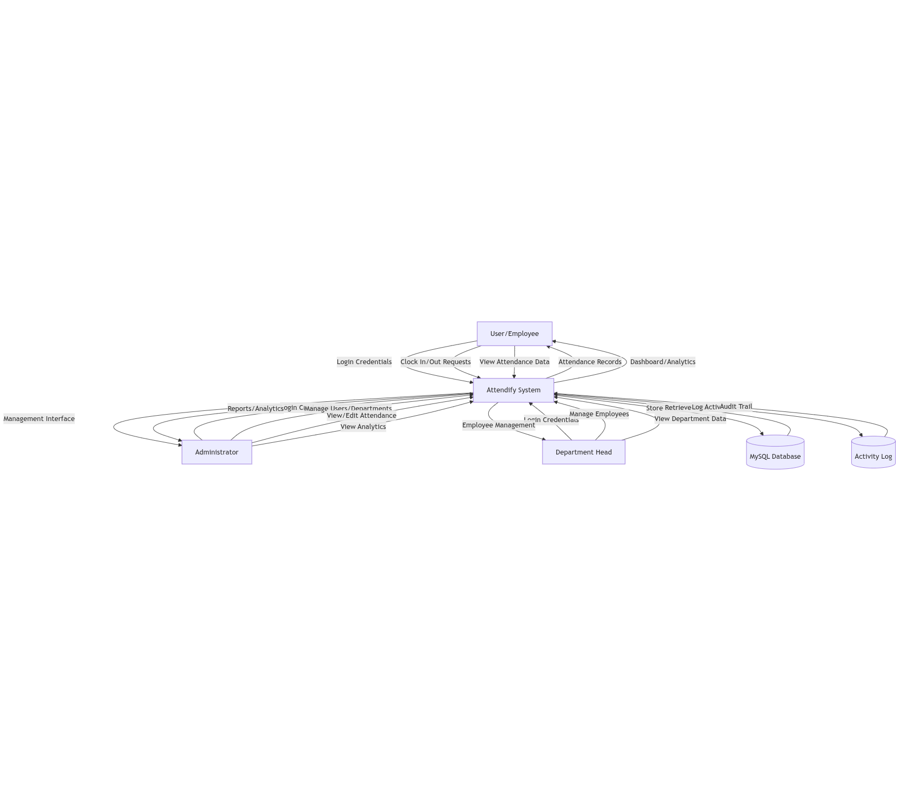

The context diagram (Level 0) shows the high-level data flows between external entities and the system:

**External Entities**:

-   **User/Employee**: Regular employees who clock in/out and view attendance
-   **Administrator**: System administrators with full access
-   **Department Head**: Department managers managing employees

**Data Stores**:

-   **MySQL Database**: Primary data storage for all entities
-   **Activity Log**: Audit trail of all system activities

**Data Flows**: The system handles authentication, attendance tracking, user/department management, analytics, and comprehensive activity logging. See the [Data Flow Diagram Level 0 documentation](diagrams/02-data-flow-diagram-level-0.md) for detailed flow descriptions.


The Level 1 diagram decomposes the system into six main processes:

1.  **Authentication Process**: Validates credentials and manages sessions
2.  **Attendance Management**: Handles clock in/out operations with validation and calculations
3.  **User Management**: CRUD operations for user accounts with role assignments
4.  **Department Management**: Department lifecycle management with status control
5.  **Analytics Processing**: Aggregates data and calculates metrics for dashboards
6.  **Activity Logging**: Records all system activities for audit purposes

Each process interacts with specific data stores and triggers activity logging. For detailed process descriptions, see the [Data Flow Diagram Level 1 documentation](diagrams/03-data-flow-diagram-level-1.md).

### Use Cases

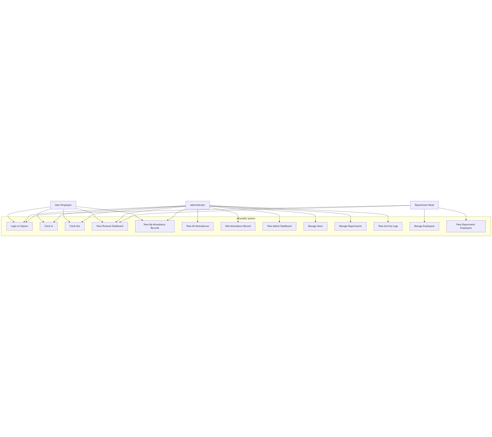

The system supports 13 primary use cases across three actor types:

**User/Employee Use Cases**:

-   Login to System
-   Clock In/Out
-   View Personal Dashboard
-   View My Attendance Records

**Administrator Use Cases**:

-   All user capabilities plus:
-   View/Edit All Attendances
-   Manage Users and Departments
-   View Admin Dashboard with organization-wide analytics
-   View Activity Logs

**Department Head Use Cases**:

-   Login and view personal dashboard
-   Manage Employees within their department
-   View Department Employees

Each use case includes detailed preconditions, postconditions, and main flow descriptions. See the [Use Case Diagram documentation](diagrams/05-use-case-diagram.md) for complete use case specifications.

### Deployment Architecture

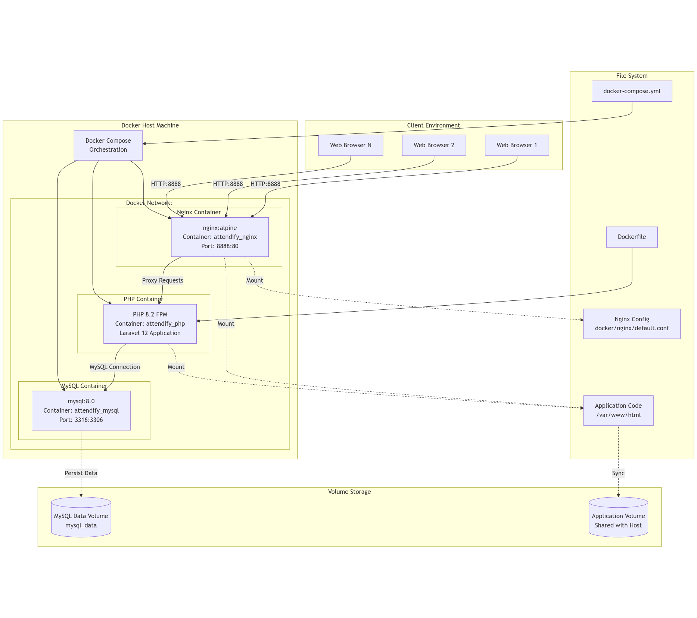

The system is containerized using Docker and Docker Compose, providing isolated, scalable deployment:

**Container Architecture**:

-   **Nginx Container** (`attendify_nginx`): Handles HTTP requests on port 8888, proxies to PHP-FPM
-   **PHP Container** (`attendify_php`): Runs Laravel 12 application with PHP 8.2 FPM
-   **MySQL Container** (`attendify_mysql`): Database server on port 3316

**Network Configuration**:

-   All containers communicate via `attendify_network` (bridge network)
-   Port mappings expose services to the host machine
-   Volume mounts enable code synchronization and data persistence

**Volume Management**:

-   MySQL data persisted in named volume for data durability
-   Application code shared between host and containers via bind mounts

For detailed deployment steps and configuration, see the [Deployment Diagram documentation](diagrams/11-deployment-diagram.md).

### Class Structure

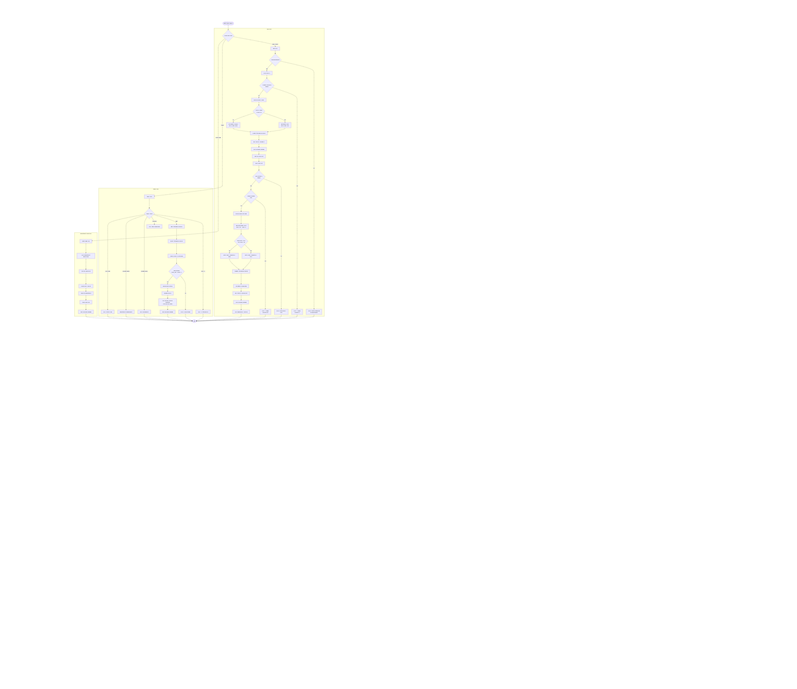

The class diagram illustrates the object-oriented design of the system:

**Domain Models**:

-   `User`: Represents system users with relationships to departments, attendances, and activity logs
-   `Attendance`: Encapsulates attendance records with calculation methods for hours, late arrival, and early departure
-   `Department`: Manages organizational departments with user and attendance relationships
-   `ActivityLog`: Provides audit trail functionality with polymorphic relationships

**Service Classes**:

-   `AttendanceService`: Handles clock in/out operations, attendance updates, and metric calculations
-   `AnalyticsService`: Calculates user-level and organization-level analytics and statistics

**Livewire Components**:

-   `ClockIn`, `ClockOut`: User interfaces for attendance operations
-   `UserDashboard`, `AdminDashboard`: Analytics display components
-   `Login`: Authentication interface with role-based redirects

The design follows service layer and repository patterns for separation of concerns. See the [Class Diagram documentation](diagrams/12-class-diagram.md) for complete class descriptions and relationships.

### Business Process Flow

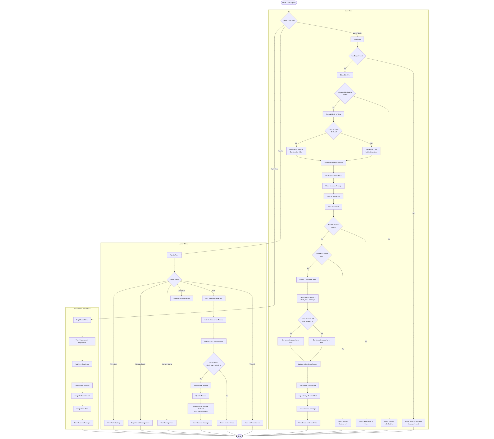

The activity diagram illustrates the complete attendance management workflow:

**User Flow**:

1.  User logs in and checks role
2.  Validates department assignment
3.  Records clock-in time with late arrival detection (8:30 AM threshold)
4.  Records clock-out time with early departure detection (before 5 PM with < 8 hours)
5.  Calculates total hours and updates attendance record
6.  Views dashboard with analytics

**Admin Flow**:

-   Can perform all user actions
-   Additional capabilities: view all attendances, edit records, manage users/departments, view activity logs

**Department Head Flow**:

-   View and manage employees within assigned department
-   Add new employees with automatic department assignment

The diagram shows decision points, error conditions, and success paths. See the [Activity Diagram documentation](diagrams/10-activity-diagram-attendance.md) for detailed process descriptions.

### Design Patterns

The system employs several design patterns:

-   **Service Layer Pattern**: Business logic separated into service classes (`AttendanceService`, `AnalyticsService`)
-   **Repository Pattern**: Eloquent ORM acts as repository abstraction
-   **Active Record Pattern**: Models contain both data and behavior
-   **Component Pattern**: Livewire components encapsulate UI and logic
-   **Dependency Injection**: Services injected into components via Laravel's service container
-   **Middleware Pattern**: Authentication and authorization handled through middleware chain

### Security Architecture

-   **Authentication**: Laravel Sanctum provides session-based authentication with CSRF protection
-   **Authorization**: Spatie Permission implements role-based access control (RBAC) with granular permissions
-   **Password Security**: Bcrypt/Argon2 hashing for password storage
-   **Activity Logging**: Comprehensive audit trail tracks all system modifications
-   **Input Validation**: Server-side validation on all user inputs
-   **SQL Injection Protection**: Eloquent ORM uses parameterized queries

### Scalability Considerations

-   **Horizontal Scaling**: Multiple PHP containers can run behind Nginx load balancer
-   **Database Scaling**: MySQL can be replaced with managed database service or read replicas
-   **Caching**: Laravel's cache system can be configured with Redis/Memcached
-   **Session Storage**: Can be moved to Redis for distributed session management
-   **Asset Optimization**: Vite builds optimized production assets

### Additional Documentation

For more detailed theoretical context and diagram specifications, refer to the [Diagrams Documentation](diagrams/README.md), which includes:

-   Sequence diagrams for clock-in, clock-out, and login processes
-   Detailed process descriptions and data flow specifications
-   Component interaction patterns
-   Deployment configuration details

## Prerequisites

-   Docker and Docker Compose installed
-   Git

## Installation

1. Clone the repository:

```bash
git clone https://github.com/zaidanali028/attendify.git
cd attendify
```

2. Build and start the Docker containers:

```bash
docker-compose up -d --build
```

3. Install PHP dependencies:

```bash
docker exec -it attendify_php composer install
```

4. Copy the environment file:

```bash
docker exec -it attendify_php cp .env.example .env
```

5. Generate application key:

```bash
docker exec -it attendify_php php artisan key:generate
```

6. Run migrations and seeders:

```bash
docker exec -it attendify_php php artisan migrate --seed
```

7. Set up storage link:

```bash
docker exec -it attendify_php php artisan storage:link
```

8. Build frontend assets:

```bash
docker exec -it attendify_php npm install
docker exec -it attendify_php npm run build
```

## Accessing the Application

-   **Application URL**: http://localhost:8888
-   **MySQL Port**: 3316

## Default Credentials

After running the seeders, you can login with:

### Admin Account

-   Email: `admin@ecgghana.com`
-   Password: `password`

### Department Head Account

-   Email: `depthead@ecgghana.com`
-   Password: `password`

### Regular User Account

-   Email: `user@ecgghana.com`
-   Password: `password`

## Database Seeding

The project includes seeders for setting up the database with initial data and optionally, comprehensive fake data for testing.

### Initial Seeders

The default seeders (`DatabaseSeeder`, `RolePermissionSeeder`, `DepartmentSeeder`) create:

-   **5 Sample Departments**: Human Resources, Finance, IT, Operations, Customer Service
-   **3 Default Roles**: User, Admin, Department Head
-   **All Required Permissions**: Clock management, dashboard access, user/department management
-   **3 Default Users**: One Admin, one Department Head, and one Regular User (see credentials above)

Run the initial seeders:

```bash
docker exec -it attendify_php php artisan db:seed
```

### Fake Data Seeder

For testing and demonstration purposes, a comprehensive fake data seeder (`FakeDataSeeder`) is available that generates:

-   **5 Department Heads** (one per department)
-   **50 Regular Users** (distributed across departments)
-   **2,000+ Attendance Records** over the last 60 days with realistic patterns:
    -   **70% On-time arrivals** (7:30 AM - 8:30 AM)
    -   **20% Slightly late** (8:31 AM - 9:30 AM)
    -   **10% Very late** (after 9:30 AM)
    -   **Early departures** (before 5 PM with < 8 hours)
    -   **Overtime scenarios** (> 8 hours worked)
    -   **Random absences** (~20% chance per weekday)
    -   **Weekend skipping** (realistic work patterns)

**Run the fake data seeder:**

```bash
docker exec -it attendify_php php artisan db:seed --class=FakeDataSeeder
```

**Note**: The fake data seeder requires that departments and roles/permissions already exist (run initial seeders first).

**Sample Credentials After Fake Data Seeding:**

-   Department Head 1: `depthead1@ecgghana.com` / `password`
-   Department Head 2: `depthead2@ecgghana.com` / `password`
-   User 1: `user1@ecgghana.com` / `password`
-   User 2: `user2@ecgghana.com` / `password`
-   ... and so on (up to user50@ecgghana.com)

**To run everything together:**

```bash
# Step 1: Run initial seeders
docker exec -it attendify_php php artisan db:seed

# Step 2: Run fake data seeder
docker exec -it attendify_php php artisan db:seed --class=FakeDataSeeder
```

**Or**, edit `database/seeders/DatabaseSeeder.php` and uncomment the line:

```php
$this->call(FakeDataSeeder::class);
```

Then run:

```bash
docker exec -it attendify_php php artisan db:seed
```

## Docker Services

-   **Nginx**: Web server (Port 8888)
-   **PHP-FPM**: PHP 8.2 with required extensions
-   **MySQL**: Database server (Port 3316)

## Project Structure

```
Attendify/
├── app/
│   ├── Livewire/          # Livewire components
│   │   ├── Admin/         # Admin components
│   │   ├── User/          # User components
│   │   ├── DepartmentHead/# Department Head components
│   │   └── Auth/          # Authentication components
│   ├── Models/            # Eloquent models
│   ├── Policies/          # Authorization policies
│   └── Services/          # Business logic services
├── database/
│   ├── migrations/        # Database migrations
│   └── seeders/           # Database seeders
├── resources/
│   ├── views/             # Blade templates
│   └── css/               # Tailwind CSS
├── docker/
│   └── nginx/             # Nginx configuration
├── Dockerfile             # PHP-FPM container definition
└── docker-compose.yml     # Docker services configuration
```

## Roles and Permissions

The system uses three roles with different permissions:

### User

-   Clock in/out
-   View own attendance records
-   View own dashboard

### Admin

-   All User permissions
-   View all attendance records
-   Edit any attendance record
-   Manage users (create/edit admins, dept heads, users)
-   Manage departments (CRUD operations)
-   View comprehensive analytics dashboard
-   Export reports

### Department Head

-   View own dashboard
-   Manage employees in their assigned department
-   Add new employees to their department

## Key Features

### Attendance Tracking

-   Automatic late arrival detection (after 8:30 AM)
-   Early departure detection (before 5:00 PM with less than 8 hours)
-   Total hours calculation
-   One attendance record per user per day

### Activity Logging

-   All attendance entries are logged
-   Attendance modifications are tracked with audit trails
-   Includes who made changes and when

### Analytics

-   User-level analytics for personal insights
-   Admin-level analytics for organization-wide insights
-   Department performance comparisons
-   Employee rankings and statistics

## Metrics and Calculations

This section explains how the system calculates various metrics and attendance indicators.

### Late Arrival Detection

**Expected Clock-In Time Definition:**

The expected clock-in time is currently **hardcoded** in the following files:

-   `app/Services/AttendanceService.php`:
    -   Line 37: `setTime(8, 30, 0)` in `clockIn()` method
    -   Line 158: `setTime(8, 30, 0)` in `updateAttendance()` method
-   `app/Models/Attendance.php`:
    -   Line 55: `setTime(8, 30, 0)` in `checkLateArrival()` method

**To change the expected clock-in time**, modify the hour and minute values in these locations:

```php
$expectedTime = $now->copy()->setTime(8, 30, 0); // Change 8, 30 to desired time
```

**Calculation Method:**

-   **Expected Clock-In Time**: 8:30 AM (configurable in code)
-   **Detection Logic**: An employee is marked as late if their clock-in time is **after** 8:30 AM
-   **Implementation**: `clock_in_time > 08:30:00` on the same day
-   **Status Update**: Attendance status is set to `'late'` instead of `'present'` if late

**Example:**

-   Clock-in at 8:25 AM → **Not Late** (status: `present`)
-   Clock-in at 8:30 AM → **Not Late** (status: `present`)
-   Clock-in at 8:31 AM → **Late** (status: `late`)

### Total Hours Worked

**Calculation Method:**

-   **Formula**: `total_hours = clock_out_time - clock_in_time` (calculated in hours)
-   **Precision**: Rounded to 2 decimal places
-   **Method**: Uses Carbon's `diffInHours()` method with `true` parameter for precise calculation
-   **Unit**: Hours (e.g., 8.50 hours = 8 hours 30 minutes)

**Example:**

-   Clock-in: 08:00 AM, Clock-out: 05:00 PM → **9.00 hours**
-   Clock-in: 09:15 AM, Clock-out: 06:30 PM → **9.25 hours**
-   Clock-in: 08:30 AM, Clock-out: 12:45 PM → **4.25 hours**

**Note**: Total hours are only calculated when both clock-in and clock-out times are recorded.

### Early Departure Detection

**Expected Clock-Out Time Definition:**

The expected clock-out time is currently **hardcoded** in the following files:

-   `app/Services/AttendanceService.php`:
    -   Line 94: `setTime(17, 0, 0)` in `clockOut()` method
    -   Line 168: `setTime(17, 0, 0)` in `updateAttendance()` method
-   `app/Models/Attendance.php`:
    -   Line 64: `setTime(17, 0, 0)` in `checkEarlyDeparture()` method

**To change the expected clock-out time**, modify the hour and minute values in these locations:

```php
$expectedTime = $now->copy()->setTime(17, 0, 0); // Change 17, 0 to desired time (24-hour format)
```

**Calculation Method:**

-   **Expected Clock-Out Time**: 5:00 PM (17:00) - configurable in code
-   **Condition 1**: Employee clocks out **before** 5:00 PM (17:00)
-   **Condition 2**: Total hours worked is **less than** 8 hours
-   **Both conditions must be true** for an early departure flag

**Implementation:**

```php
$isEarlyDeparture = ($clock_out_time < 17:00) && ($total_hours < 8.00)
```

**Example:**

-   Clock-out at 4:30 PM with 7.5 hours → **Early Departure** ✓
-   Clock-out at 4:30 PM with 8.5 hours → **Not Early Departure** (worked > 8 hours)
-   Clock-out at 5:30 PM with 7.0 hours → **Not Early Departure** (left after 5 PM)
-   Clock-out at 5:30 PM with 9.0 hours → **Not Early Departure**

### Attendance Percentage

**Calculation Method:**

-   **Working Days Definition**: Monday through Friday (weekends excluded)
-   **Formula**: `(Days Attended / Total Working Days) × 100`
-   **Days Attended**: Count of unique days with attendance records in the date range
-   **Total Working Days**: Count of weekdays (Mon-Fri) in the selected date range

**Example:**

-   Date Range: Nov 1-7, 2024 (7 days = 5 working days: Mon-Fri)
-   Days Attended: 4
-   **Attendance Percentage**: (4 / 5) × 100 = **80%**

### Overtime Hours

**Calculation Method:**

-   **Standard Work Day**: 8 hours
-   **Overtime Definition**: Hours worked **in excess** of 8 hours per day
-   **Formula per Day**: `overtime = max(0, total_hours - 8)`
-   **Total Overtime**: Sum of overtime hours across all days in the date range

**Example:**

-   Day 1: 8.5 hours → Overtime: 0.5 hours
-   Day 2: 7.0 hours → Overtime: 0 hours
-   Day 3: 9.25 hours → Overtime: 1.25 hours
-   **Total Overtime**: 0.5 + 0 + 1.25 = **1.75 hours**

### Average Break Time

**Calculation Method:**

-   **For days with > 8 hours worked**: Assumes 1 hour break time
-   **For days with ≤ 8 hours worked**: Break time = `8 - total_hours`
    -   This represents the difference between standard work day and actual hours worked
-   **Average**: Mean of all break times calculated across the date range

**Example:**

-   Day 1: 9 hours worked → Break: 1.0 hour (assumed)
-   Day 2: 7.5 hours worked → Break: 0.5 hours (8 - 7.5)
-   Day 3: 8 hours worked → Break: 0 hours (8 - 8)
-   **Average Break Time**: (1.0 + 0.5 + 0) / 3 = **0.5 hours**

**Note**: Break time calculation assumes a standard 8-hour work day and may not reflect actual break durations taken.

### Department Statistics (Admin Dashboard)

**Metrics Calculated:**

1. **Average Hours Worked**: Mean of total hours across all attendance records in the department
2. **Average Late Arrivals**: Percentage of attendance records marked as late
3. **Average Early Departures**: Percentage of attendance records marked as early departure
4. **Average Attendance Percentage**:
    - `(Total Attended Days / Total Expected Days) × 100`
    - Expected Days = (Number of Employees) × (Working Days in Date Range)

### Employee Rankings

**Calculation:**

-   Employees are ranked by **total hours worked** in the selected date range
-   Rankings are sorted in descending order (highest hours first)
-   Top 10 employees are displayed on the admin dashboard

### Working Days Calculation

**Method:**

-   **Includes**: Monday through Friday
-   **Excludes**: Saturday and Sunday
-   **Implementation**: Iterates through each day in the date range and counts only weekdays using Carbon's `isWeekday()` method

**Example:**

-   Date Range: Nov 1-10, 2024
-   Total Days: 10
-   Working Days: 8 (excluding 2 weekends)

### Standard Work Hours

The standard work day duration is currently **hardcoded** in the analytics calculations:

-   **Standard Work Day**: 8 hours
-   Used for calculating:
    -   Overtime hours (hours worked > 8 hours)
    -   Break time estimations
    -   Early departure detection (when combined with early clock-out)

**Location in Code:**

-   `app/Services/AnalyticsService.php`: Lines 31-33 (overtime calculation)
-   `app/Services/AttendanceService.php`: Line 99 (early departure check)

**To change the standard work hours**, update the numeric value `8` in these calculations.

## Configuration

Currently, the expected clock-in time, expected clock-out time, and standard work hours are **hardcoded** in the source code. To make these configurable:

1.  Add configuration values to `.env` file:

    ```env
    EXPECTED_CLOCK_IN_HOUR=8
    EXPECTED_CLOCK_IN_MINUTE=30
    EXPECTED_CLOCK_OUT_HOUR=17
    EXPECTED_CLOCK_OUT_MINUTE=0
    STANDARD_WORK_HOURS=8
    ```

2.  Create a config file (`config/attendance.php`) to read these values

3.  Update the service classes to use `config('attendance.expected_clock_in_hour')` instead of hardcoded values

This would allow administrators to adjust these settings without modifying the source code.

## Development

### Running Commands

All artisan commands should be run inside the PHP container:

```bash
docker exec -it attendify_php php artisan [command]
```

### Frontend Development

Watch for changes during development:

```bash
docker exec -it attendify_php npm run dev
```

### Database Access

Access MySQL:

```bash
docker exec -it attendify_mysql mysql -u attendify -pattendify_password attendify
```

## Troubleshooting

### Permission Issues

If you encounter permission issues with storage or cache:

```bash
docker exec -it attendify_php chown -R www-data:www-data storage bootstrap/cache
docker exec -it attendify_php chmod -R 775 storage bootstrap/cache
```

### Clear Cache

```bash
docker exec -it attendify_php php artisan optimize:clear
docker exec -it attendify_php php artisan permission:cache-reset
```

## License

This project is proprietary software developed for ECG Ghana.

## Support

For issues or questions, please contact the development team.
