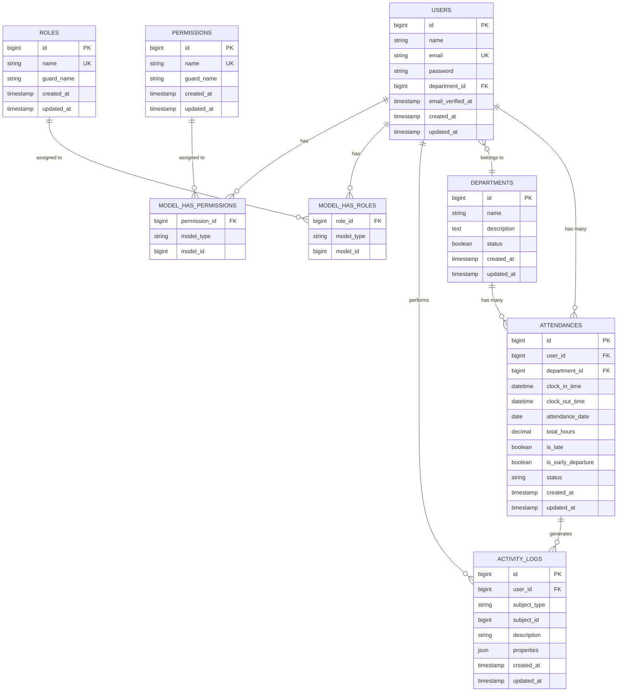

# Entity Relationship Diagram (ERD)

## Database Schema Relationships

## Key Relationships

1. **User → Department**: Many-to-One (Each user belongs to one department)
2. **User → Attendance**: One-to-Many (Each user has many attendance records)
3. **Department → Attendance**: One-to-Many (Each department has many attendance records)
4. **User → ActivityLog**: One-to-Many (Each user generates many activity logs)
5. **Attendance → ActivityLog**: One-to-Many (Each attendance can generate multiple logs)
6. **User → Roles**: Many-to-Many (Users can have multiple roles via Spatie Permission)
7. **User → Permissions**: Many-to-Many (Users can have direct permissions)

## Constraints

-   Unique constraint: `(user_id, attendance_date)` - One attendance record per user per day
-   Foreign key constraints with CASCADE on delete for data integrity
-   Email uniqueness constraint on users table
