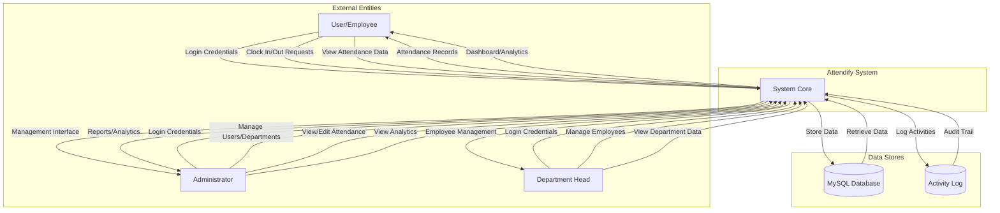

# Data Flow Diagram - Level 0 (Context Diagram)

## System Overview

## External Entities

1. **User/Employee**: Regular employees who clock in/out and view their attendance
2. **Administrator**: System administrators with full access
3. **Department Head**: Department managers who manage employees

## Data Stores

1. **MySQL Database**: Primary data storage for all entities
2. **Activity Log**: Audit trail of all system activities

## Data Flows

### Input Flows

-   Login credentials (email, password)
-   Clock in/out requests
-   User management operations
-   Department management operations
-   Attendance edit requests
-   Analytics date range filters

### Output Flows

-   Authentication responses
-   Attendance records
-   Dashboard data
-   Analytics and reports
-   Management interfaces
-   Activity logs
