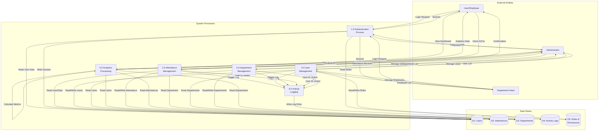

# Data Flow Diagram - Level 1 (System Decomposition)

## Detailed System Processes

## Process Descriptions

### 1.0 Authentication Process

-   **Input**: Email, Password, Remember Me
-   **Process**: Validate credentials, check roles/permissions
-   **Output**: Session token, redirect based on role
-   **Data Stores**: D1 (Users), D5 (Roles & Permissions)

### 2.0 Attendance Management

-   **Input**: Clock in/out requests, attendance edits
-   **Process**:
    -   Validate user has department
    -   Check for existing attendance
    -   Calculate late/early departure
    -   Calculate total hours
    -   Update attendance records
-   **Output**: Attendance confirmation, updated records
-   **Data Stores**: D1, D2, D3
-   **Triggers**: P6 (Activity Logging)

### 3.0 User Management

-   **Input**: Create/Edit/Delete user requests
-   **Process**:
    -   Validate user data
    -   Assign roles and departments
    -   Hash passwords
    -   Manage user relationships
-   **Output**: User list, confirmation messages
-   **Data Stores**: D1, D3, D5
-   **Triggers**: P6 (Activity Logging)

### 4.0 Department Management

-   **Input**: Create/Edit/Delete department requests
-   **Process**:
    -   Validate department data
    -   Manage department status (active/inactive)
    -   Handle employee assignments
-   **Output**: Department list, confirmation messages
-   **Data Stores**: D3, D1
-   **Triggers**: P6 (Activity Logging)

### 5.0 Analytics Processing

-   **Input**: Date range, user/department filters
-   **Process**:
    -   Aggregate attendance data
    -   Calculate metrics (hours, late arrivals, etc.)
    -   Generate department statistics
    -   Rank employees
-   **Output**: Analytics data, reports
-   **Data Stores**: D2, D1, D3

### 6.0 Activity Logging

-   **Input**: User actions, subject data
-   **Process**:
    -   Capture action details
    -   Store old/new data for updates
    -   Record timestamp and user
-   **Output**: Activity log entries
-   **Data Store**: D4

## Data Store Contents

-   **D1: Users**: User accounts, credentials, department assignments
-   **D2: Attendances**: Clock in/out times, hours, status, dates
-   **D3: Departments**: Department information, status
-   **D4: Activity Logs**: Audit trail of all system activities
-   **D5: Roles & Permissions**: RBAC configuration (Spatie Permission)
