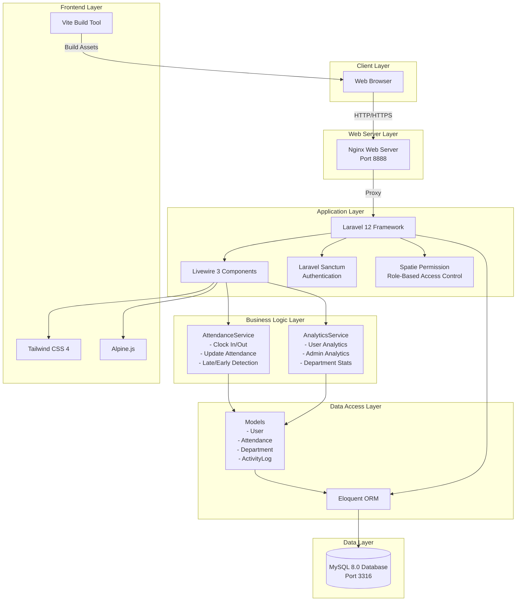
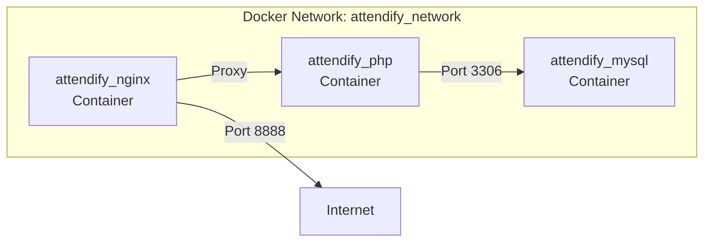

# System Architecture Diagram

## Overall System Architecture

## Component Details

### Client Layer

-   **Web Browser**: User interface rendered in modern web browsers
-   Supports responsive design with Tailwind CSS

### Web Server Layer

-   **Nginx**: Reverse proxy and static file server
-   Handles HTTP requests and routes to PHP-FPM

### Application Layer

-   **Laravel 12**: Core PHP framework handling routing, middleware, and MVC architecture
-   **Livewire 3**: Full-stack framework for dynamic UI components
-   **Laravel Sanctum**: Session-based authentication
-   **Spatie Permission**: Role and permission management

### Business Logic Layer

-   **AttendanceService**:
    -   Clock in/out operations
    -   Late arrival detection (8:30 AM threshold)
    -   Early departure detection (before 5 PM with < 8 hours)
    -   Total hours calculation
    -   Attendance record updates
-   **AnalyticsService**:
    -   User-level analytics
    -   Admin-level organization analytics
    -   Department performance metrics
    -   Employee rankings

### Data Access Layer

-   **Eloquent ORM**: Database abstraction layer
-   **Models**:
    -   User (with department relationship)
    -   Attendance (with user and department relationships)
    -   Department (with users and attendances)
    -   ActivityLog (polymorphic relationships)

### Data Layer

-   **MySQL 8.0**: Relational database
-   Stores all application data
-   Supports transactions for data integrity

### Frontend Layer

-   **Tailwind CSS 4**: Utility-first CSS framework
-   **Alpine.js**: Lightweight JavaScript framework for interactivity
-   **Vite**: Modern build tool for fast development and optimized production builds

## Technology Stack Summary

| Layer              | Technology                |
| ------------------ | ------------------------- |
| Web Server         | Nginx                     |
| Backend Framework  | Laravel 12                |
| Frontend Framework | Livewire 3                |
| CSS Framework      | Tailwind CSS 4            |
| JavaScript         | Alpine.js                 |
| Authentication     | Laravel Sanctum           |
| Authorization      | Spatie Laravel Permission |
| Database           | MySQL 8.0                 |
| Build Tool         | Vite                      |
| Containerization   | Docker & Docker Compose   |

## Deployment Architecture

-   **Nginx Container**: Handles HTTP requests
-   **PHP-FPM Container**: Runs Laravel application
-   **MySQL Container**: Database server
-   All containers communicate via Docker network
