# Use Case Diagram

## System Use Cases by Actor

```mermaid
graph TB
    subgraph "Attendify System"
        UC1[Login to System]
        UC2[Clock In]
        UC3[Clock Out]
        UC4[View Personal Dashboard]
        UC5[View My Attendance Records]
        UC6[View All Attendances]
        UC7[Edit Attendance Record]
        UC8[View Admin Dashboard]
        UC9[Manage Users]
        UC10[Manage Departments]
        UC11[View Activity Logs]
        UC12[Manage Employees]
        UC13[View Department Employees]
    end

    User[User/Employee]
    Admin[Administrator]
    DeptHead[Department Head]

    User --> UC1
    User --> UC2
    User --> UC3
    User --> UC4
    User --> UC5

    Admin --> UC1
    Admin --> UC2
    Admin --> UC3
    Admin --> UC4
    Admin --> UC5
    Admin --> UC6
    Admin --> UC7
    Admin --> UC8
    Admin --> UC9
    Admin --> UC10
    Admin --> UC11

    DeptHead --> UC1
    DeptHead --> UC4
    DeptHead --> UC12
    DeptHead --> UC13
```

## Use Case Descriptions

### UC1: Login to System

-   **Actor**: User, Admin, Department Head
-   **Description**: Authenticate and access the system
-   **Preconditions**: User has valid account
-   **Postconditions**: User is logged in and redirected based on role
-   **Main Flow**:
    1. User enters email and password
    2. System validates credentials
    3. System checks user role
    4. System redirects to appropriate dashboard

### UC2: Clock In

-   **Actor**: User, Admin
-   **Description**: Record arrival time for the day
-   **Preconditions**: User is logged in, has department assignment
-   **Postconditions**: Attendance record created with clock-in time
-   **Main Flow**:
    1. User clicks "Clock In"
    2. System checks if already clocked in today
    3. System checks if user has department
    4. System records current time
    5. System checks if late (after 8:30 AM)
    6. System creates attendance record
    7. System logs activity

### UC3: Clock Out

-   **Actor**: User, Admin
-   **Description**: Record departure time for the day
-   **Preconditions**: User has clocked in today
-   **Postconditions**: Attendance record updated with clock-out time and total hours
-   **Main Flow**:
    1. User clicks "Clock Out"
    2. System checks if clocked in today
    3. System checks if already clocked out
    4. System records current time
    5. System calculates total hours
    6. System checks for early departure
    7. System updates attendance record
    8. System logs activity

### UC4: View Personal Dashboard

-   **Actor**: User, Admin, Department Head
-   **Description**: View personal attendance analytics
-   **Preconditions**: User is logged in
-   **Postconditions**: Dashboard displayed with analytics
-   **Main Flow**:
    1. User navigates to dashboard
    2. User selects date range (optional)
    3. System calculates analytics
    4. System displays metrics (hours, late arrivals, etc.)

### UC5: View My Attendance Records

-   **Actor**: User, Admin
-   **Description**: View personal attendance history
-   **Preconditions**: User is logged in
-   **Postconditions**: Attendance records displayed
-   **Main Flow**:
    1. User navigates to "My Attendance"
    2. User selects date range (optional)
    3. System retrieves user's attendance records
    4. System displays records in table format

### UC6: View All Attendances

-   **Actor**: Admin
-   **Description**: View all employee attendance records
-   **Preconditions**: User has Admin role
-   **Postconditions**: All attendance records displayed
-   **Main Flow**:
    1. Admin navigates to "All Attendances"
    2. Admin applies filters (optional)
    3. System retrieves all attendance records
    4. System displays paginated results

### UC7: Edit Attendance Record

-   **Actor**: Admin
-   **Description**: Modify any attendance record
-   **Preconditions**: User has Admin role
-   **Postconditions**: Attendance record updated
-   **Main Flow**:
    1. Admin selects attendance record
    2. Admin clicks "Edit"
    3. Admin modifies clock in/out times
    4. System validates times
    5. System recalculates metrics
    6. System updates record
    7. System logs activity with old/new data

### UC8: View Admin Dashboard

-   **Actor**: Admin
-   **Description**: View organization-wide analytics
-   **Preconditions**: User has Admin role
-   **Postconditions**: Admin dashboard displayed
-   **Main Flow**:
    1. Admin navigates to admin dashboard
    2. Admin selects date range (optional)
    3. System calculates organization metrics
    4. System displays department stats and rankings

### UC9: Manage Users

-   **Actor**: Admin
-   **Description**: Create, edit, delete users
-   **Preconditions**: User has Admin role
-   **Postconditions**: User records created/updated/deleted
-   **Main Flow**:
    1. Admin navigates to "User Management"
    2. Admin performs CRUD operations
    3. System validates data
    4. System assigns roles and departments
    5. System logs activity

### UC10: Manage Departments

-   **Actor**: Admin
-   **Description**: Create, edit, delete departments
-   **Preconditions**: User has Admin role
-   **Postconditions**: Department records created/updated/deleted
-   **Main Flow**:
    1. Admin navigates to "Department Management"
    2. Admin performs CRUD operations
    3. System validates data
    4. System manages department status
    5. System logs activity

### UC11: View Activity Logs

-   **Actor**: Admin
-   **Description**: View audit trail of system activities
-   **Preconditions**: User has Admin role
-   **Postconditions**: Activity logs displayed
-   **Main Flow**:
    1. Admin navigates to "Activity Logs"
    2. Admin applies filters (optional)
    3. System retrieves activity logs
    4. System displays logs with details

### UC12: Manage Employees

-   **Actor**: Department Head
-   **Description**: Add employees to department
-   **Preconditions**: User has Department Head role
-   **Postconditions**: Employee added to department
-   **Main Flow**:
    1. Department Head navigates to "Employee Management"
    2. Department Head clicks "Add Employee"
    3. Department Head enters employee details
    4. System creates user account
    5. System assigns to department head's department
    6. System assigns "User" role

### UC13: View Department Employees

-   **Actor**: Department Head
-   **Description**: View employees in assigned department
-   **Preconditions**: User has Department Head role
-   **Postconditions**: Department employees displayed
-   **Main Flow**:
    1. Department Head navigates to "Employee Management"
    2. System retrieves employees from department head's department
    3. System displays employee list

## Actor Descriptions

### User/Employee

-   Regular employees who clock in/out
-   Can view their own attendance data
-   Limited to personal dashboard and records

### Administrator

-   Full system access
-   Can manage all users, departments, and attendance records
-   Can view organization-wide analytics
-   Can view activity logs

### Department Head

-   Manages employees in their assigned department
-   Can add new employees to their department
-   Can view their own dashboard
-   Limited to their department scope
