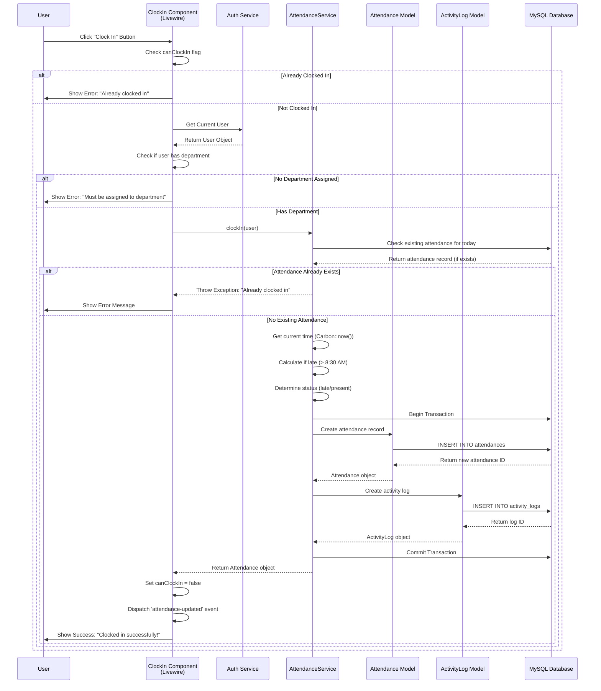

# Sequence Diagram - Clock In Process

## Clock In Flow

## Key Steps

1. **User Action**: User clicks "Clock In" button
2. **Validation**: Component checks if user can clock in
3. **Department Check**: Verifies user has department assignment
4. **Duplicate Check**: Service checks for existing attendance today
5. **Time Calculation**: Determines if arrival is late (after 8:30 AM)
6. **Database Transaction**: Creates attendance record atomically
7. **Activity Logging**: Records the clock-in action
8. **User Feedback**: Displays success/error message

## Data Flow

-   **Input**: User click action
-   **Processing**:
    -   Current timestamp
    -   Late arrival calculation
    -   Status determination
-   **Output**:
    -   Attendance record with clock_in_time
    -   Activity log entry
    -   Success confirmation

## Error Handling

-   **Already Clocked In**: Prevents duplicate clock-ins
-   **No Department**: Requires department assignment
-   **Database Errors**: Transaction rollback on failure
