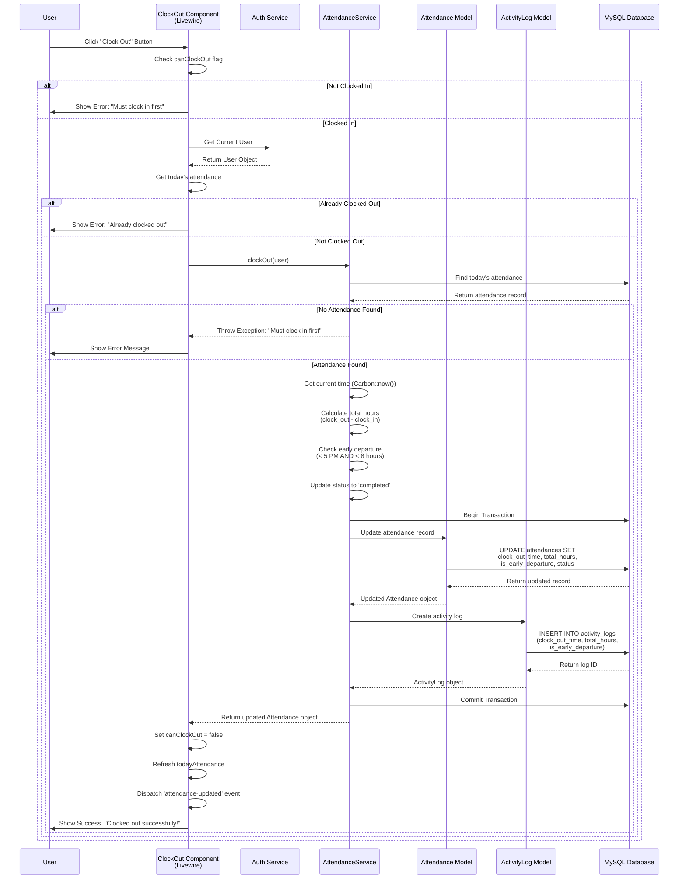

# Sequence Diagram - Clock Out Process

## Clock Out Flow



## Key Steps

1. **User Action**: User clicks "Clock Out" button
2. **Validation**: Component checks if user can clock out
3. **Attendance Check**: Verifies user has clocked in today
4. **Time Calculation**:
    - Calculates total hours worked
    - Checks for early departure (before 5 PM AND < 8 hours)
5. **Database Transaction**: Updates attendance record atomically
6. **Activity Logging**: Records the clock-out action with details
7. **User Feedback**: Displays success message with hours worked

## Data Flow

-   **Input**: User click action
-   **Processing**:
    -   Current timestamp
    -   Total hours calculation: `diffInHours(clock_out, clock_in)`
    -   Early departure check: `(clock_out < 17:00) AND (total_hours < 8)`
-   **Output**:
    -   Updated attendance record with:
        -   clock_out_time
        -   total_hours
        -   is_early_departure flag
        -   status = 'completed'
    -   Activity log entry
    -   Success confirmation

## Calculations

### Total Hours

```
total_hours = clock_out_time - clock_in_time (in hours, rounded to 2 decimals)
```

### Early Departure Detection

```
is_early_departure = (clock_out_time < 17:00) AND (total_hours < 8.00)
```

## Error Handling

-   **Not Clocked In**: Requires clock-in before clock-out
-   **Already Clocked Out**: Prevents duplicate clock-outs
-   **Database Errors**: Transaction rollback on failure
