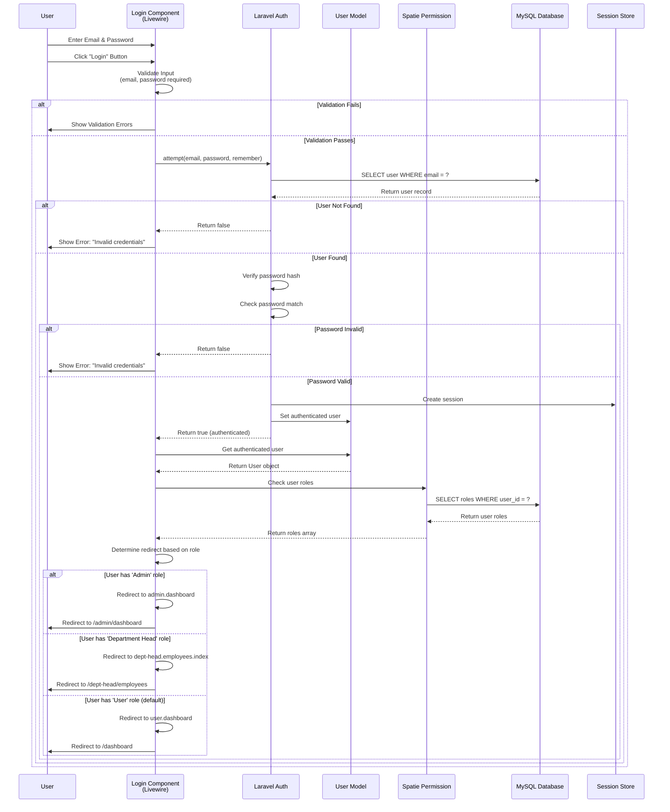

# Sequence Diagram - Login/Authentication Process

## Login Flow

## Key Steps

1. **User Input**: User enters email and password
2. **Validation**: Component validates required fields
3. **Authentication**: Laravel Auth attempts login
4. **Database Lookup**: Finds user by email
5. **Password Verification**: Compares hashed password
6. **Session Creation**: Creates authenticated session
7. **Role Check**: Retrieves user roles from Spatie Permission
8. **Role-Based Redirect**: Redirects based on user role

## Role-Based Redirects

| Role            | Redirect Route              | URL                    |
| --------------- | --------------------------- | ---------------------- |
| Admin           | `admin.dashboard`           | `/admin/dashboard`     |
| Department Head | `dept-head.employees.index` | `/dept-head/employees` |
| User (default)  | `user.dashboard`            | `/dashboard`           |

## Security Features

-   **Password Hashing**: Uses bcrypt/argon2 for password storage
-   **Session Management**: Laravel Sanctum handles session tokens
-   **Remember Me**: Optional persistent session via remember token
-   **CSRF Protection**: Laravel's built-in CSRF token validation
-   **Rate Limiting**: Prevents brute force attacks (if configured)

## Error Handling

-   **Validation Errors**: Client-side and server-side validation
-   **Invalid Credentials**: Generic error message (security best practice)
-   **Account Lockout**: Can be implemented for multiple failed attempts
-   **Session Expiry**: Automatic logout after inactivity

## Data Flow

-   **Input**: Email, Password, Remember Me (optional)
-   **Processing**:
    -   Email lookup
    -   Password hash verification
    -   Role retrieval
-   **Output**:
    -   Authenticated session
    -   User object in session
    -   Redirect to appropriate dashboard
