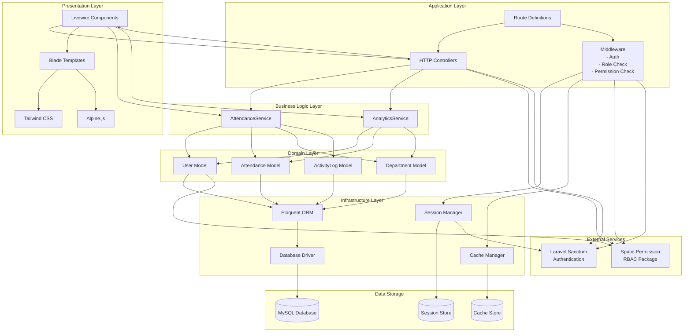

# Component Diagram

## System Components and Dependencies

## Component Descriptions

### Presentation Layer

#### Livewire Components

-   **Admin Components**: AdminDashboard, AllAttendance, EditClock, Departments/Index, Users/Index, ActivityLogs
-   **User Components**: UserDashboard, ClockIn, ClockOut, MyAttendance
-   **Department Head Components**: Employees/Index
-   **Auth Components**: Login

#### Blade Templates

-   View templates for each Livewire component
-   Layout templates (app.blade.php)
-   Component templates

#### Frontend Technologies

-   **Tailwind CSS**: Utility-first CSS framework
-   **Alpine.js**: Lightweight JavaScript framework

### Application Layer

#### HTTP Controllers

-   Base Controller class
-   Handles HTTP requests and responses

#### Middleware

-   **Authentication Middleware**: Verifies user is logged in
-   **Role Middleware**: Checks user has specific role
-   **Permission Middleware**: Checks user has specific permission

#### Routes

-   Web route definitions
-   Route groups with middleware
-   Named routes for navigation

### Business Logic Layer

#### AttendanceService

**Responsibilities**:

-   Clock in/out operations
-   Attendance record updates
-   Late arrival detection
-   Early departure detection
-   Total hours calculation

**Dependencies**: User, Attendance, Department, ActivityLog models

#### AnalyticsService

**Responsibilities**:

-   User-level analytics calculation
-   Admin-level analytics calculation
-   Department statistics
-   Employee rankings

**Dependencies**: User, Attendance, Department models

### Domain Layer

#### Models

-   **User**: Represents system users
-   **Attendance**: Represents attendance records
-   **Department**: Represents organizational departments
-   **ActivityLog**: Represents audit trail entries

**Relationships**:

-   User belongsTo Department
-   User hasMany Attendances
-   User hasMany ActivityLogs
-   Department hasMany Users
-   Department hasMany Attendances
-   Attendance belongsTo User
-   Attendance belongsTo Department
-   ActivityLog belongsTo User
-   ActivityLog morphTo (polymorphic)

### Infrastructure Layer

#### Eloquent ORM

-   Database abstraction layer
-   Query builder
-   Relationship management
-   Model lifecycle hooks

#### Database Driver

-   MySQL PDO driver
-   Connection management
-   Query execution

#### Session Manager

-   Session storage and retrieval
-   Session security
-   Session expiration

#### Cache Manager

-   Application cache
-   Query result caching
-   Configuration caching

### External Services

#### Spatie Permission

-   Role management
-   Permission management
-   Role-permission assignments
-   User-role assignments

#### Laravel Sanctum

-   Session-based authentication
-   API token authentication
-   CSRF protection

### Data Storage

#### MySQL Database

-   Primary data storage
-   Relational data management
-   Transaction support

#### Session Store

-   User session data
-   Flash messages
-   CSRF tokens

#### Cache Store

-   Application cache
-   Configuration cache
-   Route cache

## Component Interactions

1. **User Request Flow**:

    - Browser → Routes → Middleware → Controller/Livewire → Service → Model → Database

2. **Authentication Flow**:

    - Login → Auth Service → Session Manager → Sanctum → Database

3. **Authorization Flow**:

    - Request → Middleware → Spatie Permission → Database → Allow/Deny

4. **Data Flow**:
    - Service → Model → Eloquent → Database Driver → MySQL

## Dependency Direction

-   **High-level components** depend on **low-level components**
-   **Business logic** depends on **domain models**
-   **Domain models** depend on **infrastructure**
-   **External services** are injected via dependency injection
