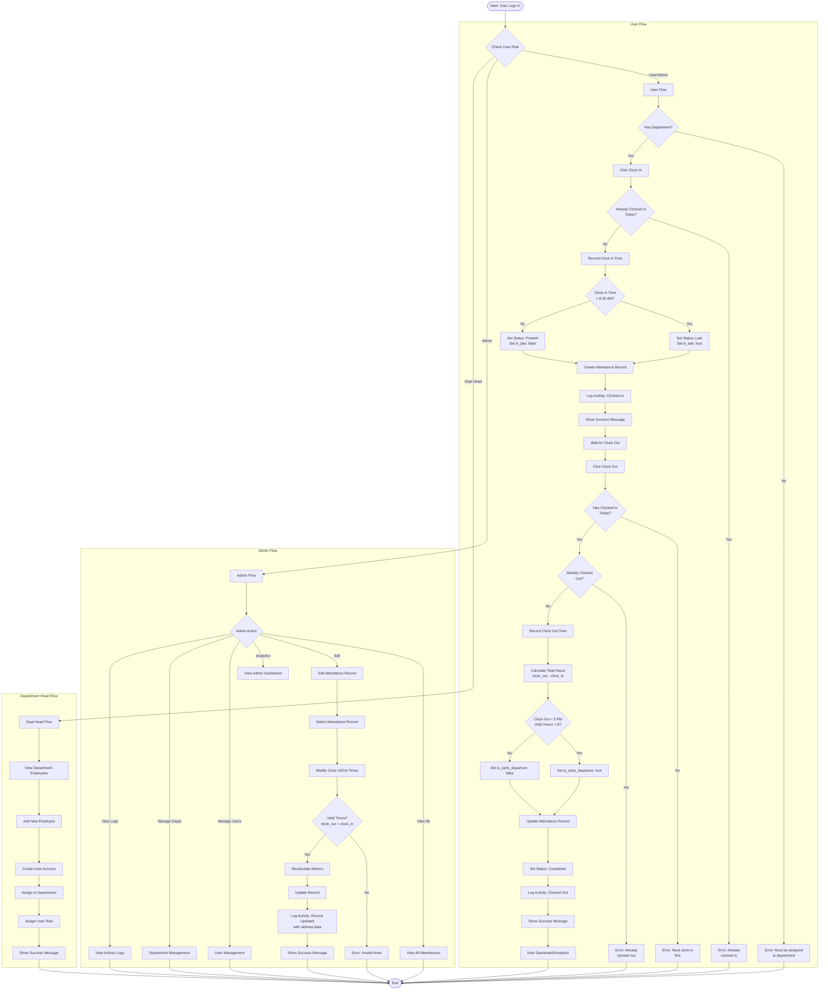

# Activity Diagram - Attendance Management Process

## Complete Attendance Workflow

## Process Descriptions

### User Clock In Process

1. **Check Department**: Verify user has department assignment
2. **Check Duplicate**: Ensure not already clocked in today
3. **Record Time**: Capture current timestamp
4. **Check Late**: Determine if arrival is after 8:30 AM
5. **Create Record**: Insert attendance record with status
6. **Log Activity**: Record clock-in action
7. **User Feedback**: Display success message

### User Clock Out Process

1. **Check Clock In**: Verify user has clocked in today
2. **Check Duplicate**: Ensure not already clocked out
3. **Record Time**: Capture current timestamp
4. **Calculate Hours**: Compute total hours worked
5. **Check Early**: Determine if early departure (before 5 PM AND < 8 hours)
6. **Update Record**: Update attendance with clock-out data
7. **Log Activity**: Record clock-out action
8. **User Feedback**: Display success message

### Admin Edit Attendance Process

1. **Select Record**: Choose attendance record to edit
2. **Modify Times**: Update clock in/out times
3. **Validate**: Ensure clock-out is after clock-in
4. **Recalculate**: Recompute all metrics (late, early, hours)
5. **Update Record**: Save changes to database
6. **Log Activity**: Record edit with old/new data
7. **User Feedback**: Display success message

### Department Head Employee Management

1. **View Employees**: Display employees in department
2. **Add Employee**: Create new user account
3. **Assign Department**: Link to department head's department
4. **Assign Role**: Set role to "User"
5. **User Feedback**: Display success message

## Decision Points

-   **Has Department?**: Required for clock-in
-   **Already Clocked In?**: Prevents duplicates
-   **Is Late?**: Determines status (late vs present)
-   **Has Clocked In?**: Required for clock-out
-   **Already Clocked Out?**: Prevents duplicates
-   **Is Early Departure?**: Before 5 PM AND < 8 hours
-   **Valid Times?**: Clock-out must be after clock-in

## Error Conditions

1. **No Department**: User must be assigned to department
2. **Duplicate Clock In**: Already clocked in today
3. **No Clock In**: Must clock in before clocking out
4. **Duplicate Clock Out**: Already clocked out today
5. **Invalid Times**: Clock-out must be after clock-in

## Success Conditions

1. **Clock In Success**: Attendance record created
2. **Clock Out Success**: Attendance record updated with hours
3. **Edit Success**: Attendance record updated with new times
4. **Add Employee Success**: User account created and assigned
