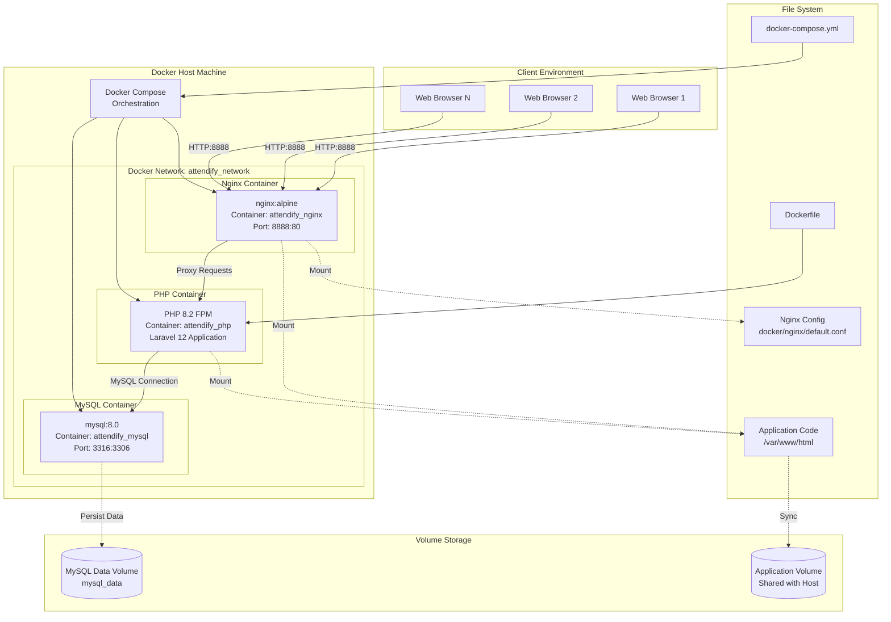

# Deployment Diagram

## System Deployment Architecture



## Container Details

### Nginx Container

-   **Image**: `nginx:alpine`
-   **Container Name**: `attendify_nginx`
-   **Port Mapping**: `8888:80`
-   **Volumes**:
    -   Application code: `./:/var/www/html`
    -   Nginx config: `./docker/nginx/default.conf:/etc/nginx/conf.d/default.conf`
-   **Dependencies**: PHP container
-   **Network**: `attendify_network`

### PHP Container

-   **Base Image**: PHP 8.2 FPM
-   **Container Name**: `attendify_php`
-   **Built From**: `Dockerfile`
-   **Volumes**:
    -   Application code: `./:/var/www/html`
-   **Dependencies**: MySQL container
-   **Network**: `attendify_network`
-   **Extensions**: Required PHP extensions for Laravel

### MySQL Container

-   **Image**: `mysql:8.0`
-   **Container Name**: `attendify_mysql`
-   **Port Mapping**: `3316:3306`
-   **Environment Variables**:
    -   `MYSQL_DATABASE`: `attendify`
    -   `MYSQL_ROOT_PASSWORD`: `root`
    -   `MYSQL_USER`: `attendify`
    -   `MYSQL_PASSWORD`: `attendify_password`
-   **Volumes**:
    -   Data persistence: `mysql_data:/var/lib/mysql`
-   **Network**: `attendify_network`

## Network Configuration

### Docker Network

-   **Name**: `attendify_network`
-   **Driver**: `bridge`
-   **Purpose**: Enables communication between containers
-   **Containers Connected**:
    -   attendify_nginx
    -   attendify_php
    -   attendify_mysql

## Volume Management

### MySQL Data Volume

-   **Name**: `mysql_data`
-   **Type**: Named volume
-   **Purpose**: Persist database data across container restarts
-   **Location**: `/var/lib/mysql` in container

### Application Volume

-   **Type**: Bind mount
-   **Source**: Host directory (`./`)
-   **Destination**: Container directory (`/var/www/html`)
-   **Purpose**: Sync application code between host and container

## Port Mappings

| Service | Container Port | Host Port | Access                |
| ------- | -------------- | --------- | --------------------- |
| Nginx   | 80             | 8888      | http://localhost:8888 |
| MySQL   | 3306           | 3316      | localhost:3316        |

## Deployment Steps

1. **Build Containers**:

    ```bash
    docker-compose build
    ```

2. **Start Services**:

    ```bash
    docker-compose up -d
    ```

3. **Install Dependencies**:

    ```bash
    docker exec -it attendify_php composer install
    docker exec -it attendify_php npm install
    ```

4. **Configure Application**:

    ```bash
    docker exec -it attendify_php cp .env.example .env
    docker exec -it attendify_php php artisan key:generate
    ```

5. **Setup Database**:

    ```bash
    docker exec -it attendify_php php artisan migrate --seed
    ```

6. **Build Frontend**:
    ```bash
    docker exec -it attendify_php npm run build
    ```

## Service Dependencies

```
Nginx depends on: PHP
PHP depends on: MySQL
MySQL: No dependencies
```

## Access Points

-   **Web Application**: http://localhost:8888
-   **MySQL Database**: localhost:3316
-   **Container Access**: `docker exec -it <container_name> <command>`

## Environment Configuration

### Application Environment

-   Configured via `.env` file
-   Database connection: `attendify_mysql:3306`
-   Application URL: `http://localhost:8888`

### Container Environment

-   Managed via `docker-compose.yml`
-   Environment variables passed to containers
-   Network configuration for inter-container communication

## Scaling Considerations

-   **Horizontal Scaling**: Can run multiple PHP containers behind Nginx load balancer
-   **Database Scaling**: MySQL can be replaced with managed database service
-   **Storage Scaling**: MySQL volume can be expanded or moved to external storage
-   **High Availability**: Can deploy multiple instances with shared storage
