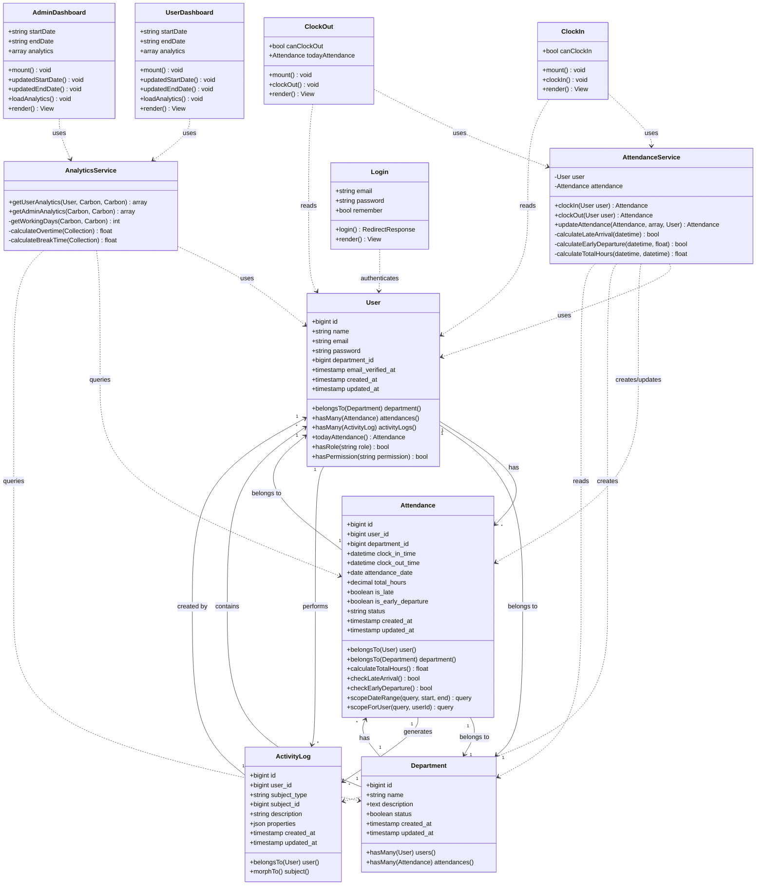

# Class Diagram

## System Classes and Relationships

## Class Descriptions

### Domain Models

#### User

-   **Purpose**: Represents system users (employees, admins, department heads)
-   **Key Methods**:
    -   `department()`: Get user's department
    -   `attendances()`: Get user's attendance records
    -   `todayAttendance()`: Get today's attendance record
    -   `hasRole()`: Check if user has specific role (Spatie Permission)
    -   `hasPermission()`: Check if user has specific permission

#### Department

-   **Purpose**: Represents organizational departments
-   **Key Methods**:
    -   `users()`: Get all users in department
    -   `attendances()`: Get all attendance records for department

#### Attendance

-   **Purpose**: Represents attendance records
-   **Key Methods**:
    -   `calculateTotalHours()`: Calculate hours between clock in/out
    -   `checkLateArrival()`: Check if clock-in is after 8:30 AM
    -   `checkEarlyDeparture()`: Check if clock-out is before 5 PM with < 8 hours
    -   `scopeDateRange()`: Query scope for date filtering
    -   `scopeForUser()`: Query scope for user filtering

#### ActivityLog

-   **Purpose**: Audit trail of system activities
-   **Key Methods**:
    -   `user()`: Get user who performed action
    -   `subject()`: Get polymorphic subject (Attendance, User, etc.)

### Service Classes

#### AttendanceService

-   **Purpose**: Business logic for attendance operations
-   **Key Methods**:
    -   `clockIn()`: Process clock-in with validation and calculations
    -   `clockOut()`: Process clock-out with hour calculations
    -   `updateAttendance()`: Admin function to edit attendance records
-   **Responsibilities**:
    -   Validate business rules
    -   Calculate metrics (late, early, hours)
    -   Create activity logs
    -   Manage database transactions

#### AnalyticsService

-   **Purpose**: Calculate analytics and statistics
-   **Key Methods**:
    -   `getUserAnalytics()`: Calculate user-level metrics
    -   `getAdminAnalytics()`: Calculate organization-level metrics
    -   `getWorkingDays()`: Calculate working days (Mon-Fri)
-   **Responsibilities**:
    -   Aggregate attendance data
    -   Calculate percentages and averages
    -   Generate rankings
    -   Compute department statistics

### Livewire Components

#### ClockIn

-   **Purpose**: User interface for clocking in
-   **Properties**:
    -   `canClockIn`: Boolean flag for clock-in availability
-   **Methods**:
    -   `mount()`: Initialize component state
    -   `clockIn()`: Handle clock-in action
    -   `render()`: Render view

#### ClockOut

-   **Purpose**: User interface for clocking out
-   **Properties**:
    -   `canClockOut`: Boolean flag for clock-out availability
    -   `todayAttendance`: Today's attendance record
-   **Methods**:
    -   `mount()`: Initialize component state
    -   `clockOut()`: Handle clock-out action
    -   `render()`: Render view

#### UserDashboard

-   **Purpose**: Display user's personal analytics
-   **Properties**:
    -   `startDate`: Filter start date
    -   `endDate`: Filter end date
    -   `analytics`: Calculated analytics data
-   **Methods**:
    -   `loadAnalytics()`: Fetch and calculate analytics
    -   `updatedStartDate()`: React to date change
    -   `updatedEndDate()`: React to date change

#### AdminDashboard

-   **Purpose**: Display organization-wide analytics
-   **Properties**: Similar to UserDashboard
-   **Methods**: Similar to UserDashboard but uses `getAdminAnalytics()`

#### Login

-   **Purpose**: Authentication interface
-   **Properties**:
    -   `email`: User email
    -   `password`: User password
    -   `remember`: Remember me flag
-   **Methods**:
    -   `login()`: Authenticate and redirect based on role

## Relationships

### Associations

-   **User ↔ Department**: Many-to-One (belongsTo)
-   **User ↔ Attendance**: One-to-Many (hasMany)
-   **Department ↔ Attendance**: One-to-Many (hasMany)
-   **User ↔ ActivityLog**: One-to-Many (hasMany)
-   **Attendance ↔ ActivityLog**: One-to-Many (polymorphic)

### Dependencies

-   **Services → Models**: Services use models for data access
-   **Components → Services**: Components use services for business logic
-   **Components → Models**: Components read model data for display

## Design Patterns

1. **Service Layer Pattern**: Business logic separated into service classes
2. **Repository Pattern**: Eloquent ORM acts as repository
3. **Active Record Pattern**: Models contain data and behavior
4. **Component Pattern**: Livewire components encapsulate UI and logic
5. **Dependency Injection**: Services injected into components
